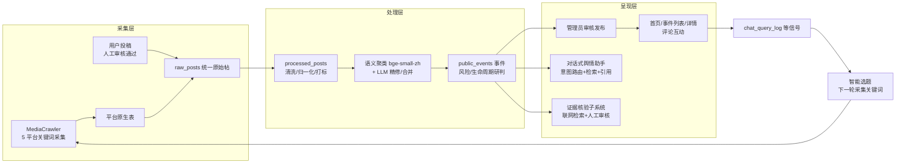

# 校声智枢（Campus AI Agent）需求分析报告

> 《软件工程》期末大作业 · 交付物 1 / 9
>
> 项目名称：校声智枢 · Campus AI Agent —— 校园舆情感知与智能分析平台
> 团队成员：李泽勋（组长）、刘思雨、陈继橦、胡津
> 文档版本：v2.0（终版，与已交付系统逐条对齐）

## 修订历史

| 版本 | 阶段 | 变更说明 | 评审 |
|------|------|----------|------|
| v0.9 | 第 1 周 | 初稿：项目目标、核心业务流程、角色划分、第一批功能需求（采集/清洗/展示） | 全体评审通过 |
| v1.0 | 第 2 周 | 增补管理后台与账号权限需求；确定统一接口返回格式约束（见 docs/dev-guide.md §4） | 全体评审通过 |
| v1.5 | 第 3~5 周 | 增补对话式舆情助手（意图路由、引用溯源、ReAct）与证据核验子系统需求；量化性能指标 | 全体评审通过 |
| v2.0 | 第 7 周 | 终版：按 MoSCoW 复核优先级落地情况，补齐"需求—测试"追踪矩阵与实测指标；按最终提交形式（源码 + 演示视频 + 公网部署）增补交付需求 | 全体评审通过 |

---

## 1. 引言

### 1.1 编写目的

本报告定义"校声智枢"平台的业务目标、功能需求与非功能需求，作为设计、实现、测试与验收的**唯一需求基线**。报告面向三类读者：开发团队（据此实现与测试）、课程评审教师（据此验收）、后续维护者（据此理解系统边界）。

本报告的每一条功能需求都标注了**实现锚点**（后端端点 / 前端页面 / 核心模块），每一条关键需求都在第 11 章给出**需求—测试追踪**，保证"写下的需求可验证、交付的功能可回溯"。

### 1.2 项目背景

高校校园中，学生对宿舍后勤、食堂、教务安排、校园安全等议题的讨论散落在微博、贴吧、知乎、快手、小红书等多个平台。学校相关部门面临三个现实困难：

1. **信息分散**：同一事件在多平台以不同表述出现，人工归并成本高；
2. **响应滞后**：负面舆情缺乏量化的热度与风险信号，难以及时分级响应；
3. **真伪难辨**：传言与事实混杂，缺乏可溯源的证据支撑。

本项目面向校园管理场景，构建一条"**多平台采集 → 清洗入库 → 语义聚类成事件 → LLM 研判风险 → 可视化呈现 → 对话式问答 → 证据核验**"的完整舆情处理管线，并通过评论、投稿、反馈机制让学生参与到舆情共治中。

### 1.3 项目特色：AI 深度融合

本项目**不是"传统信息系统 + 一个聊天机器人"的拼装**，而是把 AI 能力融合进数据管线的每一个环节——从"帖子如何聚成事件"到"风险如何分级"再到"回答如何被核查"，AI 是系统的骨架而非外挂。全景如下：

| # | AI 能力 | 所在环节 | 技术路线 | 对应需求 | 量化验证 |
|---|---------|----------|----------|----------|----------|
| 1 | 语义事件聚类 | 事件生成 | bge-small-zh-v1.5 嵌入向量 + 余弦阈值聚类 | FR-C3 | 黄金集 **65.7%** vs 规则基线 23.7%（近 3 倍） |
| 2 | 聚类精修与近重合并 | 事件生成 | LLM 裁决"是不是同一件事"，拆大桶、具体化标题 | FR-C4 / C5 | 消融实验留档（docs/*-ablation） |
| 3 | 风险 / 情绪 / 生命周期研判 | 事件研判 | LLM 通道 + 规则兜底双通道 | FR-C6 / C7 | 情绪黄金集准确率 75% → **100%** |
| 4 | 对话式舆情助手 | 用户交互 | 意图路由 + 语义检索 + ReAct 多步工具推理 | FR-E1~E9 | 26 题金标基准 **63/63** |
| 5 | 引用溯源 + Critic 复核 | 可信生成 | 结论逐条编号引用 + 生成后二次事实核查 | FR-E3 / E6 | 引用合法率 **100%** |
| 6 | 提示注入防御 | AI 安全 | 爬取内容进入 LLM 上下文前对抗性净化 | FR-E7 | 对抗样例测试通过 |
| 7 | 智能选题 | 采集闭环 | 用户提问日志等五路信号 → 下一轮采集关键词规划 | FR-G5 | 形成"使用反哺采集"数据飞轮 |
| 8 | 联网证据核验 | 事实核查 | 多提供方 LLM 联网检索 + 抓取核验 + 人工终审 | FR-H1~H5 | SSRF 防护 8 用例 |
| 9 | 帖子级语义检索 | 检索底座 | 离线向量构建 + 在线余弦匹配 | 支撑 FR-E1 | 零外部检索服务依赖 |

AI 融合遵循三条**工程治理原则**（贯穿设计与实现，详见架构设计文档）：

1. **可测量的用算术，需要判断的用 AI**——互动热度、时效衰减等可计算量用确定性算法；"两个帖子是不是一件事"这类判断题才交给 embedding（判"像不像"）和 LLM（判"是不是"）。AI 不滥用，每一处都有不可替代性。
2. **LLM 优先、规则兜底**——全部 9 处 AI 环节都有确定性降级通道，断网 / 无 API Key 时系统功能完整，AI 增强但不绑架可用性。
3. **AI 产出必须可验证**——三套人工标注金标数据集量化 AI 质量，6 组消融实验证明每处 AI 的真实增益，对话结论强制引用溯源 + Critic 复核。拒绝"效果全靠感觉"的黑盒 AI。

### 1.4 术语与缩写

| 术语 | 定义 |
|------|------|
| 原始帖（raw_posts） | 爬虫采集的多平台帖子统一落库形态，`(platform, external_id)` 唯一 |
| 加工帖（processed_posts） | 清洗、归一化、打标后的帖子，事件聚类的输入 |
| 事件（public_events） | 由语义聚类 + LLM 精修产生的舆情事件，经人工审核后对外发布 |
| 热度分（heat_score） | 由点赞/收藏/评论/转发加权得到的互动热度 |
| heat_rank | 平台内归一化排序分，消除平台间互动量量纲差异 |
| 意图路由 | 将用户提问分类到"事件查询/统计/闲聊"等处理通道的模块，规则优先、LLM 兜底 |
| ReAct | Agent 的"推理—行动—观察"多步工具调用循环 |
| Critic | LLM 生成结论后的二次事实核查通道 |
| 证据核验 | 针对事件联网检索权威信源、抓取核验、人工审核后入库的子系统 |
| 双通道降级 | LLM 优先、规则算法兜底的可靠性设计：断网/无 Key 时系统仍可运行 |
| SSRF | 服务端请求伪造。本系统对出站抓取 URL 做内网地址拦截 |

### 1.5 参考资料

- `docs/dev-guide.md`（团队开发规范：分支、提交、接口格式）
- `docs/api.md`、`docs/database.md`、`docs/architecture.md`（接口/库表/架构基线）
- `docs/week2 ~ week7` 系列迭代验收文档（需求逐周演进的过程记录）
- `PRODUCT.md`、`DESIGN.md`（产品定义与设计决策）

---

## 2. 项目目标与成功指标

目标必须可度量。立项时确定了 5 个业务目标（G1–G5），并在第 7 周终版复核了达成情况。其中 G2、G3 直接度量 AI 融合成效——AI 不是宣传词，而是写进目标、有基线对照、被数据验收的核心能力：

| 编号 | 目标 | 度量方式 | 目标值 | 终版实测 |
|------|------|----------|--------|----------|
| G1 | 打通多平台真实数据管线 | 真实语料规模（去重后） | ≥ 500 条 | **866 条**（微博/贴吧/知乎/快手/小红书 5 平台） |
| G2 | 事件聚类质量显著优于规则基线 | 聚类黄金集（66 条标注）纯度/成对 F1 | 语义通道 ≥ 50% | 语义 **65.7%** vs 规则基线 23.7% |
| G3 | 对话助手回答可信、可溯源 | 26 题金标基准：总分 / 引用合法率 | ≥ 90% / 100% | **63/63（100%）**，引用合法 **100%** |
| G4 | 交互性能满足在线使用 | 问答延迟 P50；事件列表接口延迟 | ≤ 20s；≤ 1s | **14.1s**；**0.7s**（自 4.2s 优化而来） |
| G5 | 工程质量达到可维护标准 | 自动化测试规模；零网络依赖可复跑 | ≥ 800 用例 | **1600+ 用例**（后端 1124 + 爬虫 180 + 子仓 305），全部离线可跑 |

---

## 3. 干系人分析

| 干系人 | 关注点 | 对需求的影响 |
|--------|--------|--------------|
| 校方管理部门（目标用户） | 及时发现高风险舆情、研判处置优先级、留存处置审计记录 | 驱动风险分级、生命周期研判、审计日志、证据核验需求 |
| 在校学生（目标用户） | 了解校园热点、表达意见、投稿线索 | 驱动公开事件浏览、评论、投稿、反馈需求 |
| 课程评审教师 | 软件工程方法完整性、系统真实可运行；**以演示视频与公网站点远程验收** | 驱动文档体系、测试体系、真实数据管线、公网部署与视频演示需求 |
| 开发团队自身 | 可维护、可协作、可回归 | 驱动分层架构、双仓同步、统一规范、离线测试需求 |
| 数据来源平台 | 合规访问 | 驱动采集约束：仅公开内容、限速、登录态本地保存不入库 |

---

## 4. 用户角色与权限矩阵

系统实行三级角色，前端路由守卫与后端接口鉴权**双重校验**（前端 `router/index.js` meta 守卫 + 后端 JWT 依赖注入）：

| 能力 | 游客 | 普通用户（user） | 管理员（admin） |
|------|:----:|:----:|:----:|
| 浏览公开事件列表 / 详情（/events） | ✅ | ✅ | ✅ |
| 首页仪表盘、数据分析页 | ❌ | ✅ | ✅ |
| 舆情工作台、舆情助手对话、舆情关注 | ❌ | ✅ | ✅ |
| 事件评论、举报、投稿、反馈 | ❌ | ✅ | ✅ |
| 后台概览 / 事件审核 / 数据管理 / 智能选题 | ❌ | ❌ | ✅ |
| 证据采集 / 投稿审核 / 评论管控 / 运维中心 | ❌ | ❌ | ✅ |

越权访问统一跳转 403（ForbiddenView）；未登录访问受限页跳转登录页。

---

## 5. 业务流程总览

管线是**闭环**的：用户提问与互动行为回流为"智能选题"信号，驱动下一轮采集关键词推荐，形成数据自我迭代。

---

## 6. 功能需求

优先级采用 MoSCoW：M=Must（必须）、S=Should（应该）、C=Could（可以）。所有 M/S 级需求均已实现并有自动化测试覆盖；每条需求给出可执行的验收标准与实现锚点。与 AI 直接相关的需求（FR-C3~C7、FR-E1~E9、FR-G5、FR-H1~H5 等共 19 条，占功能需求的 43%）已在 §1.3 的 AI 能力地图中交叉索引。

### 6.1 账号与权限（FR-A）

| 编号 | 需求 | 描述与验收标准 | 优先级 | 实现锚点 |
|------|------|----------------|:------:|----------|
| FR-A1 | 用户注册 | 用户名唯一；重复注册返回 409 而非 500（并发场景验证） | M | `POST /api/auth/register` |
| FR-A2 | 登录与会话 | 登录颁发 JWT，携带角色与过期时间；`/auth/me` 可取回当前身份 | M | `POST /api/auth/login`、`GET /api/auth/me` |
| FR-A3 | 角色权限控制 | 前端路由守卫 + 后端接口鉴权双重校验；普通用户访问管理端返回 403 | M | `router/index.js`、各 admin 路由依赖 |
| FR-A4 | 登录后落点分流 | 普通用户登录后进入首页仪表盘，管理员进入后台概览 | S | LoginView 跳转逻辑 |
| FR-A5 | 用户封禁管理 | 管理员可停用/启用账号，停用账号无法登录 | S | `PATCH /api/admin/users/{id}/status` |

### 6.2 数据采集（FR-B)

| 编号 | 需求 | 描述与验收标准 | 优先级 | 实现锚点 |
|------|------|----------------|:------:|----------|
| FR-B1 | 多平台关键词采集 | 支持微博/贴吧/知乎/快手/小红书 5 平台按关键词采集公开帖子与高赞评论 | M | `MediaCrawler/media_platform/*` |
| FR-B2 | 增量去重 | 同平台同帖再次采集不重复入库：`(platform, external_id)` 唯一约束 + SKIP_EXISTING 跳过 | M | 各平台 `*_SKIP_EXISTING_NOTES`、DB 唯一索引 |
| FR-B3 | 时间窗与主题过滤 | 支持发布时间窗过滤；主题相关词/排除词双向过滤，降低脏数据比例 | S | `CRAWL_PUBLISH_TIME_*`、`TOPIC_*_TERMS` |
| FR-B4 | 多机协同采集 | 基于数据库任务队列（租约 lease 机制）实现多台机器分工爬取、断点续跑、卡死任务回收 | S | `store/crawl_queue`、`scripts/seed_crawl_queue` 等 3 脚本 |
| FR-B5 | 互动量刷新 | 已入库帖子可随采集顺路刷新点赞/评论数，使热度随时间演进 | S | 快手已实现（commit 3f4bbad），其余平台按同模式扩展 |
| FR-B6 | 登录态持久化 | 平台登录态保存于本地浏览器数据目录，不写入代码仓库 | M | `SAVE_LOGIN_STATE`、`browser_data/`（已 gitignore） |
| FR-B7 | 采集节流合规 | 请求间随机延时、单轮采集量上限、仅采集公开内容 | M | `CRAWLER_MIN/MAX_SLEEP_SEC`、`CRAWLER_MAX_NOTES_COUNT` |

### 6.3 数据处理与事件生成（FR-C）

| 编号 | 需求 | 描述与验收标准 | 优先级 | 实现锚点 |
|------|------|----------------|:------:|----------|
| FR-C1 | 原始帖统一入库 | 平台原生表 → raw_posts 统一 schema，脚本幂等可复跑 | M | `scripts/sync_media_to_raw_posts` |
| FR-C2 | 清洗与归一化 | 文本去噪、互动数解析（支持"1.2万"等格式）、关键词归一化 | M | `scripts/process_raw_posts`、core `normalizer/adapter` |
| FR-C3 | 语义事件聚类 | bge-small-zh-v1.5 向量 + 余弦阈值聚类；黄金集质量 ≥ 规则基线 2 倍（实测 65.7% vs 23.7%） | M | core `semantic_clustering` |
| FR-C4 | LLM 聚类精修 | 大桶拆分、事件标题具体化；LLM 不可用时保留原簇（降级不阻塞） | S | core `llm_refine` |
| FR-C5 | 近重事件合并 | 跨轮次相似事件由 LLM 裁决是否为同一事件并合并 | S | core `llm_merge`、`event_merger` |
| FR-C6 | 风险与情绪研判 | 事件级风险分级（低/中/高）与情绪分类；LLM 通道 + 规则兜底双通道 | M | core `llm_risk/sentiment_risk`、`sentiment_llm` |
| FR-C7 | 生命周期研判 | 事件状态（新发/发酵/平息）随时间与数据演进 | S | core `llm_lifecycle`、`event_lifecycle` |
| FR-C8 | 热度与排序 | heat_score 互动加权 + heat_rank 平台内归一化 + 平台权重 + 时效衰减（近期优先、严重性不打折） | M | core `scoring/platform_weights/recency`、`heat_ranking` |
| FR-C9 | 跨运行事件记忆 | 多轮生成事件 ID 稳定，不因复跑而重建事件 | M | core `memory` |

### 6.4 舆情洞察与展示（FR-D）

| 编号 | 需求 | 描述与验收标准 | 优先级 | 实现锚点 |
|------|------|----------------|:------:|----------|
| FR-D1 | 首页态势仪表盘 | 帖子量趋势折线、风险结构、"需要关注"清单；**结论必须等数据加载完成后渲染**（禁止先显示"态势平稳"再跳变） | M | HomeView |
| FR-D2 | 公开事件列表/详情 | 游客可浏览已发布事件；列表接口 ≤ 1s（实测 0.7s） | M | EventListView/EventDetailView、`GET /api/events` |
| FR-D3 | 数据分析页 | 情绪分布、风险统计可视化 | S | SentimentView、`GET /api/sentiment/stats` |
| FR-D4 | 舆情关注页 | 中高风险事件关注与影响评估、处置队列 | S | PersonalView |
| FR-D5 | 舆情工作台 | 面向分析人员的 Agent 辅助分析入口 | S | OpinionView |
| FR-D6 | 真实数据原则 | 前端不得以 mock 数据兜底展示（曾出现"先显示假数据再刷新"缺陷，已作为需求红线修复并回归） | M | commit ca2abb5 |

### 6.5 对话式舆情助手（FR-E）

| 编号 | 需求 | 描述与验收标准 | 优先级 | 实现锚点 |
|------|------|----------------|:------:|----------|
| FR-E1 | 自然语言问答 | 就校园舆情提问，26 题金标基准得分 100%（63/63） | M | `POST /api/agent/public/chat` |
| FR-E2 | 意图路由 | 规则优先、动态词表、LLM 兜底，将提问分流到事件查询/统计/闲聊通道 | M | `intent_router`、`router_keywords` |
| FR-E3 | 引用可溯源 | 回答中的每个结论标注引用编号，可回链到具体帖子/证据；基准引用合法率 100% | M | `citations`、`opinion_report` |
| FR-E4 | 流式输出 | 长回答分块流式返回，改善等待体验 | S | `POST /api/agent/public/chat/stream` |
| FR-E5 | 多步推理 | ReAct 循环支持"检索→观察→再检索"多步工具调用，带预算上限防失控 | S | `react_loop` |
| FR-E6 | 生成后核查 | Critic 通道对生成结论做二次事实核查 | S | `critic` |
| FR-E7 | 注入防御 | 爬取内容中的提示注入语句不得改变 Agent 行为（对抗样例测试覆盖） | M | `prompt_guard` |
| FR-E8 | 会话记忆 | 多轮对话话题继承；记忆本地持久化且不写共享库 | S | `chat_memory_store` |
| FR-E9 | 事件裁决 | "用户问的是不是这件事"由 LLM 裁决，避免字面匹配误判 | S | `event_judge` |

### 6.6 公众参与（FR-F）

| 编号 | 需求 | 描述与验收标准 | 优先级 | 实现锚点 |
|------|------|----------------|:------:|----------|
| FR-F1 | 事件评论 | 登录用户可评论、一层回复 | S | `POST /api/events/{id}/comments` |
| FR-F2 | 评论举报与自动隐藏 | 举报计数原子递增，达到阈值自动隐藏（并发安全已验证） | S | `POST /api/comments/{id}/report` |
| FR-F3 | 用户投稿 | 支持文字+图片线索投稿；"我的投稿"可查进度；审核通过写回数据管线 | S | `POST /api/submissions` |
| FR-F4 | 用户反馈 | 反馈提交与管理端处理闭环 | C | `POST /api/feedback` |

### 6.7 管理后台（FR-G）

| 编号 | 需求 | 描述与验收标准 | 优先级 | 实现锚点 |
|------|------|----------------|:------:|----------|
| FR-G1 | 后台概览 | 今日工作台 + 数据管线健康度（各环节数量、最近任务真实完成时间） | M | `GET /api/admin/overview` |
| FR-G2 | 事件审核 | 状态流转（待审/发布/驳回/归档）、重命名、人工建事件；每次变更写审核日志 | M | admin_events 路由、EventReviewLog |
| FR-G3 | 事件修正 | 合并事件、事件加帖/移帖、帖子剔除（软删除）；人工修正加 curated 锁防被自动管线覆盖 | M | `event_curation` |
| FR-G4 | 级联一致删除 | 删除事件必须级联清理成员链接与审核日志，MySQL 外键下不产生 500 | M | 审计修复 commit 1306305 |
| FR-G5 | 智能选题 | 基于用户提问日志等五路信号推荐下一轮采集关键词 | S | `keyword_planner`、`GET /api/admin/keyword-suggestions` |
| FR-G6 | 数据管理 | 原始帖浏览、采集任务记录查询 | S | `GET /api/admin/raw-posts`、`/admin/crawl-tasks` |
| FR-G7 | 审计日志 | 管理员操作日志、系统日志可查询，关键操作可追责 | M | AdminOperationLog、SystemLog |
| FR-G8 | 投稿/评论管控 | 投稿审核（并发重复审核返回 409）、评论隐藏/恢复 | S | admin submissions/comments 路由 |

### 6.8 证据核验子系统（FR-H）

| 编号 | 需求 | 描述与验收标准 | 优先级 | 实现锚点 |
|------|------|----------------|:------:|----------|
| FR-H1 | 证据采集任务 | 管理员就某事件发起联网证据检索 run，可查任务进度 | S | `POST /api/admin/evidence/runs` |
| FR-H2 | 多提供方检索 | 支持多个 LLM 联网检索提供方，单一提供方失败不影响整体 | S | `evidence/providers`、`provider_adapters` |
| FR-H3 | URL 规范化去重 | canonical URL SHA-256 唯一约束，同一文档不重复入库 | S | `evidence/canonicalize`、EvidenceDocument |
| FR-H4 | 抓取核验安全 | 出站抓取前拦截内网/环回/云元数据地址（SSRF 防护）；前端证据外链过滤伪协议 | M | `evidence/verification.private_network_reason` |
| FR-H5 | 人工审核与交付 | 证据条目人工审核后批量交付进入数据管线，来源域名白名单（scope）约束 | S | `review_delivery`、`scope_policy` |

---

## 7. 非功能需求

### 7.1 性能需求（NFR-P）

| 编号 | 指标 | 目标值 | 实测值 | 测量方式 |
|------|------|--------|--------|----------|
| NFR-P1 | 对话问答延迟 P50 | ≤ 20s（含 LLM 多步推理） | **14.1s** | `scripts/eval_chat_benchmark.py`，26 题基准 |
| NFR-P2 | 对话问答延迟 P95 | ≤ 60s | 32.3s（基线轮实测） | 同上 |
| NFR-P3 | 事件列表接口 | ≤ 1s | **0.7s**（由 4.2s 经消除 N+1 优化） | commit f150cfc 前后对比 |
| NFR-P4 | 首页首屏 | 各卡片并行加载，无串行阻塞；结论组件等数据就绪再渲染 | 已达成 | 首页 N+1 修复 + FR-D1 |
| NFR-P5 | 数据规模设计容量 | 帖子 10⁴ 级下列表/统计接口不退化 | 索引迁移已就位 | `scripts/add_indexes`、`add_crawler_unique_indexes` |

### 7.2 安全需求（NFR-S）

| 编号 | 需求 | 落地手段 |
|------|------|----------|
| NFR-S1 | 认证与授权 | JWT（密钥、过期时间可配置）；前后端双重角色校验 |
| NFR-S2 | 出站抓取防 SSRF | 抓取前解析主机名，拦截私网/环回/链路本地/云元数据地址 |
| NFR-S3 | 前端外链安全 | 证据外链经 `isSafeUrl` 过滤 `javascript:` 等伪协议，`rel="noopener noreferrer"` |
| NFR-S4 | 提示注入防御 | 爬取内容进入 LLM 上下文前经 prompt_guard 处理，对抗样例测试覆盖 |
| NFR-S5 | 敏感配置隔离 | 凭据仅存 `.env`（gitignore），仓库只含 `.env.example` 键名模板；登录态浏览器数据不入库 |
| NFR-S6 | 操作可审计 | 管理员操作日志、事件审核日志、系统日志三类审计记录 |
| NFR-S7 | 并发安全 | 注册/审核/举报等竞态场景以数据库唯一约束兜底，冲突返回 409 而非脏数据 |

### 7.3 可靠性需求（NFR-R）

| 编号 | 需求 | 落地手段 |
|------|------|----------|
| NFR-R1 | LLM 依赖降级 | 全部 LLM 环节（聚类精修/风险/情绪/裁决）规则通道兜底，断网/无 Key 系统功能完整 |
| NFR-R2 | LLM 调用韧性 | 客户端内置重试、本地磁盘缓存、用量追踪 |
| NFR-R3 | 数据管线幂等 | 全部建表/迁移/导入脚本幂等可复跑，复跑不产生重复数据 |
| NFR-R4 | 采集局部失败隔离 | 单条入库失败/单关键词异常不中断整轮采集；任务取消不产生虚假成功遥测 |
| NFR-R5 | 存储降级 | 共享 MySQL 不可用时可退回本地 SQLite 运行与演示 |

### 7.4 可维护性需求（NFR-M）

| 编号 | 需求 | 落地手段 |
|------|------|----------|
| NFR-M1 | 分层架构 | routers（接口）/ services（业务）/ agent core（算法）三层，职责单一 |
| NFR-M2 | 核心算法便携 | `public_opinion_core` 仅依赖 Python 标准库，可独立测试与移植 |
| NFR-M3 | 双仓一致性 | Agent 子项目与主项目间以白名单同步脚本（`sync_opinion_core.py`，dry-run 先行）保证核心代码单一事实源 |
| NFR-M4 | 自动化回归 | 三套测试共 1600+ 用例，全部零网络依赖，任何改动可分钟级回归 |
| NFR-M5 | 统一规范 | 分支/提交/接口格式规范成文（dev-guide.md）并在 221 次提交中执行 |

### 7.5 易用性、兼容性与交付（NFR-U / NFR-C）

| 编号 | 需求 | 说明 |
|------|------|------|
| NFR-U1 | 差异化落点 | 游客免注册可浏览公开事件；普通用户/管理员登录后分流到各自主页 |
| NFR-U2 | 状态透明 | 403/404 独立页面；数据卡片区分加载中/空态/错误态 |
| NFR-C1 | 本地部署 | Windows 一键启动（run.bat / dev.bat）；MySQL 与 SQLite 双后端 |
| NFR-C2 | 离线可演示 | embedding 模型本地快照加载、LLM 规则降级、演示数据快照脚本（make_demo_snapshot），断网环境功能完整 |
| NFR-C3 | **公网可访问部署** | 系统须可部署至公网服务器，评审者在浏览器输入网址即可访问全部三类角色功能，无需本地环境；前端静态构建（`npm run build`）+ 后端单进程（uvicorn）低成本部署。部署方案与操作步骤详见《软件配置与运维文档》 | 
| NFR-C4 | 远程验收支持 | 最终以"源码 + 功能演示视频 + 公网站点"形式提交验收：演示视频完整覆盖三类角色核心场景（脚本见交付物 8），公网站点内置演示账号供评审登录体验 |

---

## 8. 数据需求

| 数据域 | 表 | 要点 |
|--------|-----|------|
| 业务主线 | raw_posts / processed_posts / public_events / event_post_links | 原始→加工→事件三级模型；事件-帖多对多；软删除（excluded）保留证据链 |
| 用户参与 | users / event_comments / user_submissions / user_feedback | 站内 UGC 与账号体系 |
| 运营审计 | crawl_tasks / agent_run_logs / event_review_logs / admin_operation_logs / system_logs | 全链路操作可追溯 |
| 证据核验 | evidence_runs / queries / documents / items / verifications / delivery_batches | 六表独立子域，文档按 canonical URL 哈希去重 |

数据完整性规则：外键关系明确（删除事件级联清理链接与审核日志）；跨平台去重靠唯一约束而非应用层判断；废弃表（user_tasks 等）在模型文件中显式标注不再使用。

---

## 9. 约束与假设

**约束**

1. 课程周期约束：开发周期约 7 周，按周迭代交付（week2~week7 验收文档留档）。
2. 成本约束：共享云 MySQL 为免费实例，LLM 使用免费/低成本额度 API，故需求上强制要求"规则兜底 + 本地缓存"。
3. 合规约束：仅采集公开内容，限速采集，登录态与凭据不进入代码仓库。
4. 环境约束：开发环境为 Windows；embedding 可选依赖（torch 约 500MB）不作为硬性要求，未安装时自动退回规则聚类。
5. **交付形式约束**：课程不安排现场答辩，最终以"源码压缩包 + 功能演示视频 + 公网可访问站点"提交，故公网部署（NFR-C3）与演示视频（NFR-C4）列为交付级硬性需求。

**假设**

1. 校园舆情以中文平台为主，embedding 选型面向中文（bge-small-zh）。
2. 单校场景下数据量在 10⁴~10⁵ 帖量级，现有索引与分页设计可支撑。
3. 管理员为受训的校方人员，事件发布前有人工审核环节兜底。

---

## 10. 需求优先级与迭代计划落实

按 MoSCoW 统计：Must 21 项、Should 22 项、Could 1 项。**全部 Must/Should 需求已实现**；逐周落地脉络与 `docs/week2~week7` 验收文档一一对应：

| 迭代 | 需求落地 |
|------|----------|
| 第 1 周 | 团队规范（dev-guide）、库表基线、采集选型 |
| 第 2 周 | FR-A 账号权限、FR-G 管理后台骨架、统一接口格式 |
| 第 3 周 | FR-E2 意图路由、FR-E8 会话记忆、可视化 |
| 第 4 周 | FR-E6 Critic、FR-E7 注入防御、评测框架 |
| 第 5 周 | FR-E5 ReAct、FR-C3 语义聚类 |
| 第 6 周 | FR-C6 LLM 情绪、FR-B4 多机协同采集 |
| 第 7 周 | FR-C4/C5 精修与合并、FR-E3 引用简报、FR-H 证据核验、消融实验与终版基准 |
| 收尾 | NFR-C3 公网部署、NFR-C4 演示视频（交付前完成） |

---

## 11. 需求验证与可追踪性

### 11.1 验证方法

1. **评审**：每周迭代结束全体评审，验收结论写入 week 系列文档；
2. **测试驱动**：功能需求以"先写失败测试→实现→回归"的 TDD 流程落地；
3. **金标基准**：对话质量（26 题）、聚类质量（66 条标注）、情绪分类（黄金集）三套人工标注数据集量化验收；
4. **消融实验**：对 LLM 精修、风险研判、时效衰减等增强项做"开/关"对照实验（`scripts/ablation_*` 6 个脚本），证明每项需求的真实收益，防止"为了做而做"；
5. **覆盖率验收**：`scripts/check_question_coverage.py` 验证真实问题清单覆盖率 ≥ 80%。

### 11.2 需求—测试追踪矩阵（代表性样例）

完整矩阵见《软件测试与质量保证报告》；此处列代表行证明追踪机制真实存在：

| 需求 | 验证载体 | 结果 |
|------|----------|------|
| FR-A1 注册唯一性（并发） | `backend/tests/test_audit_batch1_prod_crash.py` | 通过（409 而非 500） |
| FR-C3 语义聚类质量 | 子仓 `clustering_eval` + 66 条黄金集 | 65.7% vs 基线 23.7% |
| FR-E3 引用合法率 | `eval_chat_benchmark.py` 引用判分项 | 100% |
| FR-E7 注入防御 | 子仓 prompt 注入对抗测试 | 通过 |
| FR-G4 删除级联一致 | `test_audit_batch1_prod_crash.py` | 通过 |
| FR-H4 SSRF 防护 | `backend/tests/test_evidence_ssrf.py`（8 用例） | 通过 |
| FR-B2 增量去重 | MediaCrawler 跳过已存在笔记测试 | 通过 |
| NFR-P1 问答延迟 | 基准 JSON 留档（docs/data/eval_benchmark_*.json） | P50 14.1s |
| NFR-R1 LLM 降级 | 全测试套件零网络依赖即为常态化验证 | 1600+ 用例离线全绿 |

### 11.3 需求变更管理

需求变更经"提出 → 组内评审 → 修订本报告 → 更新追踪矩阵"流程，版本记录见文首修订历史。两个典型变更示例：

- FR-D6"真实数据原则"：第 6 周体验走查发现前端存在 mock 兜底，按变更流程补入需求红线并当周修复回归；
- NFR-C3/C4"公网部署与视频验收"：课程交付形式由现场答辩调整为远程验收后，第 7 周按变更流程补入交付级需求。

---

*本报告与系统实现逐条对齐：所有端点、模块、指标均可在代码仓库与 docs/ 留档中复核。*
