# 校声智枢（Campus AI Agent）系统建模报告

> 《软件工程》期末大作业 · 交付物 2 / 9
>
> 项目名称：校声智枢 · Campus AI Agent —— 校园舆情感知与智能分析平台
> 团队成员：李泽勋（组长）、刘思雨、陈继橦、胡津
> 文档版本：v2.0（终版，全部模型与代码实测对齐）

## 修订历史

| 版本 | 阶段 | 变更说明 |
|------|------|----------|
| v1.0 | 第 1~2 周 | 初版：用例模型、数据模型类图（业务主线三级表） |
| v1.5 | 第 3~5 周 | 增补对话助手序列图、核心域类图、事件审核状态机 |
| v2.0 | 第 7 周 | 终版：证据核验子域建模、爬取队列状态机、模型—代码一致性映射全量复核 |

---

## 1. 引言

### 1.1 建模目的与方法

本报告以 UML 为建模语言，从四个互补视角刻画系统：**用例模型**（谁用系统做什么）、**静态结构模型**（类图：数据与模块如何组织）、**动态行为模型**（序列图：一次请求如何流经各层）、**状态模型**（状态机图：关键实体的生命周期）。

两条工程实践值得说明：

1. **图即代码（Diagram as Code）**：全部模型采用 Mermaid 文本语法编写，与源代码同仓库版本管理——模型变更走与代码相同的分支/提交/评审流程，可 diff、可回溯，从机制上避免"文档与代码两张皮"。
2. **模型可核对**：每张图在第 6 章给出源码锚点（文件/类/字段），所有状态取值（如事件的 `draft/published/rejected/archived`）均从代码中核实，而非示意性虚构。

### 1.2 建模范围

覆盖主系统（FastAPI 后端 + Vue 3 前端）、舆情核心算法包（`backend/agent/public_opinion_core`）、采集子系统（MediaCrawler 定制版）与证据核验子域。部署视角的建模（部署图、组件间物理拓扑）见《架构设计文档》，不在此重复。

---

## 2. 用例模型

### 2.1 参与者（Actors)

| 参与者 | 类型 | 说明 |
|--------|------|------|
| 游客 | 主要 | 未登录访问者，仅可浏览公开事件 |
| 普通用户（user） | 主要 | 注册学生：浏览、提问、评论、投稿、反馈 |
| 管理员（admin） | 主要 | 校方运营人员：审核、修正、选题、核验、运维 |
| 采集运维员 | 主要 | 执行爬虫与数据管线脚本的团队成员（命令行界面） |
| LLM 服务 | 次要（外部系统） | OpenAI 兼容接口 / 智谱 GLM，供研判、对话、联网检索 |
| 社交平台 | 次要（外部系统） | 微博/贴吧/知乎/快手/小红书，数据来源 |

### 2.2 用例图

UML 用例图按三个功能域给出（Mermaid 以 flowchart 语法呈现，椭圆语义用圆角节点表达；系统边界用子图表达）：

**图 2-1 公众与用户侧用例**

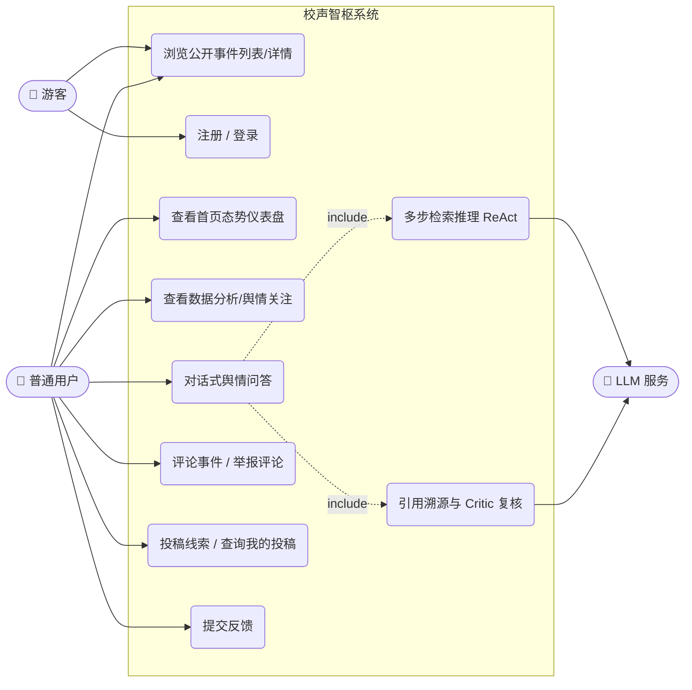

**图 2-2 管理侧用例**

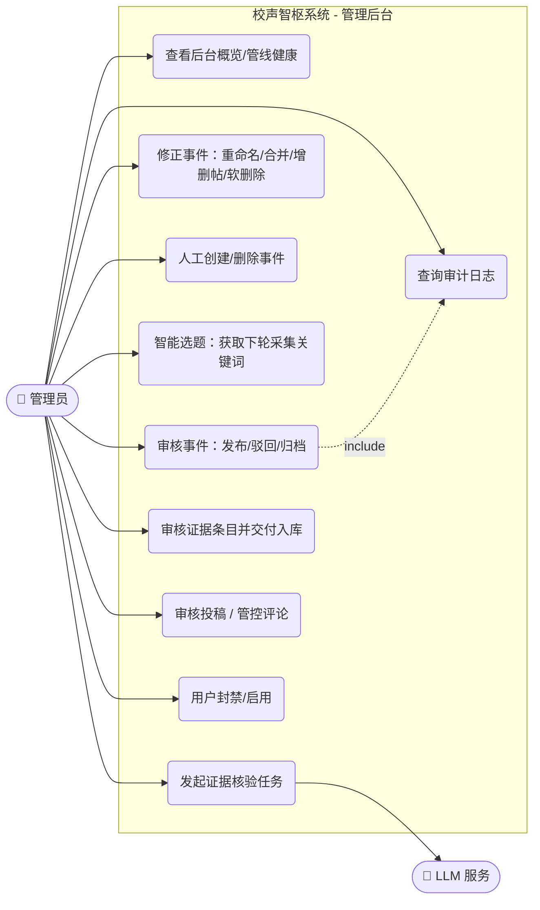

**图 2-3 采集与数据管线用例**

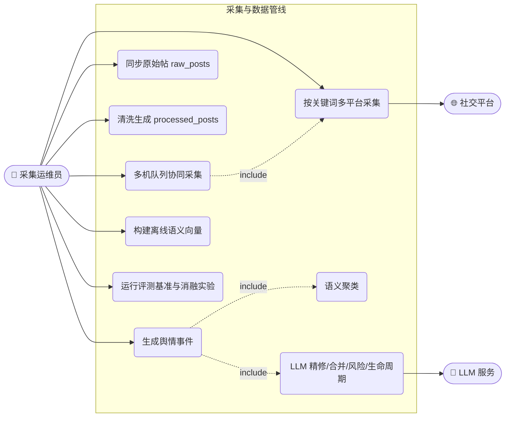

### 2.3 关键用例规约

**UC-01 对话式舆情问答**（对应 FR-E1~E9）

| 条目 | 内容 |
|------|------|
| 参与者 | 普通用户 / 管理员 |
| 前置条件 | 已登录；系统中存在已发布事件数据 |
| 主流程 | 1. 用户在"舆情助手"页输入问题 → 2. 意图路由判定问题类型（事件查询/统计/闲聊）→ 3. 语义检索召回相关事件与帖子 → 4. 需要时 LLM 裁决"问的是否为该事件"→ 5. ReAct 循环补充检索 → 6. 生成带编号引用的结论 → 7. Critic 二次核查 → 8. 流式返回答案 |
| 扩展流程 | 2a. 路由规则未命中 → LLM 兜底分类；5a. LLM 不可用 → 规则通道直接生成确定性简报；6a. 检索无结果 → 明确告知"暂无相关数据"而非编造 |
| 后置条件 | 提问写入 chat_query_log（成为智能选题信号）；用量计入统计 |
| 验收基准 | 26 题金标基准 63/63，引用合法率 100%，P50 14.1s |

**UC-02 事件审核发布**（对应 FR-G2~G4）

| 条目 | 内容 |
|------|------|
| 参与者 | 管理员 |
| 前置条件 | 数据管线已生成 `draft` 状态事件 |
| 主流程 | 1. 管理员在"事件审核"页查看待审事件 → 2. 核对成员帖与研判结果 → 3. 必要时修正（重命名/合并/增删帖）→ 4. 置为 `published` → 5. 系统写入 EventReviewLog 审核日志 → 6. 事件对游客可见 |
| 扩展流程 | 4a. 内容不实 → `rejected`；4b. 已过时 → `archived`；3a. 人工修正后事件加 `curated` 锁，后续自动管线不覆盖人工结论 |
| 后置条件 | 每次状态变更均有审计记录；删除事件时级联清理成员链接与审核日志 |

**UC-03 证据核验**（对应 FR-H1~H5）

| 条目 | 内容 |
|------|------|
| 参与者 | 管理员；LLM 服务（外部） |
| 前置条件 | 存在需要事实核查的事件 |
| 主流程 | 1. 管理员发起证据采集 run → 2. 多提供方并行联网检索 → 3. URL 规范化 + SHA-256 去重 → 4. 抓取核验（先过 SSRF 内网拦截闸）→ 5. 管理员逐条审核证据 → 6. 批量交付入库进入数据管线 |
| 扩展流程 | 2a. 单一提供方失败 → 隔离该路，其余照常；4a. 目标为内网/环回地址 → 拒绝抓取并标记 needs_review；5a. 来源不在域名白名单 → 不允许交付 |
| 后置条件 | 证据与事件关联，Agent 回答可引用权威信源 |

---

## 3. 静态结构模型（类图）

### 3.1 数据模型类图

**图 3-1 业务主线与用户参与域**（`backend/models.py`、`backend/admin_models.py`）

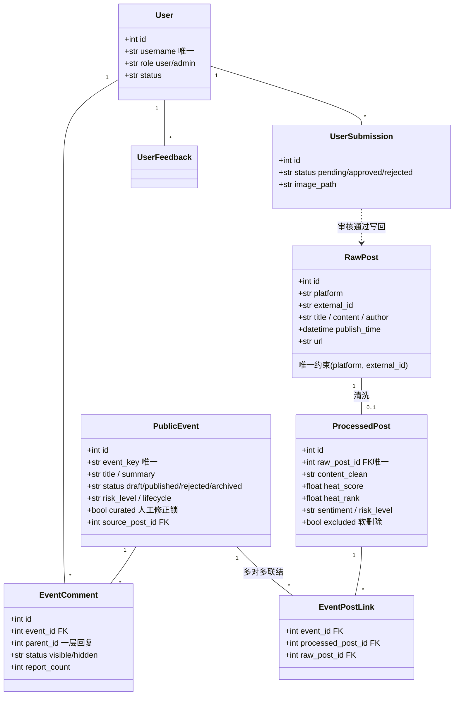

**图 3-2 运营审计域**（`backend/admin_models.py`）

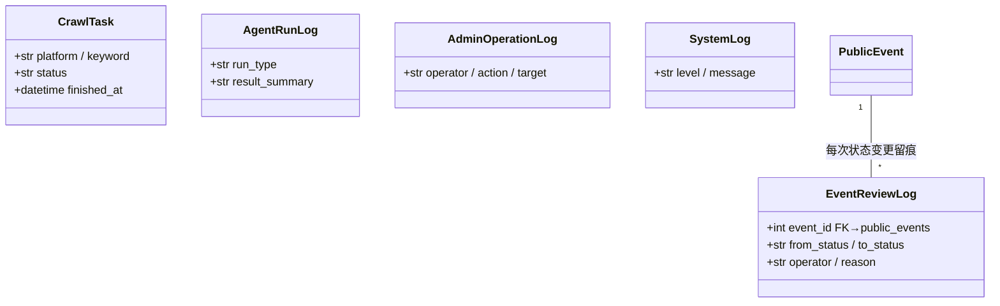

**图 3-3 证据核验子域**（`backend/models_evidence.py`，六表独立子域）

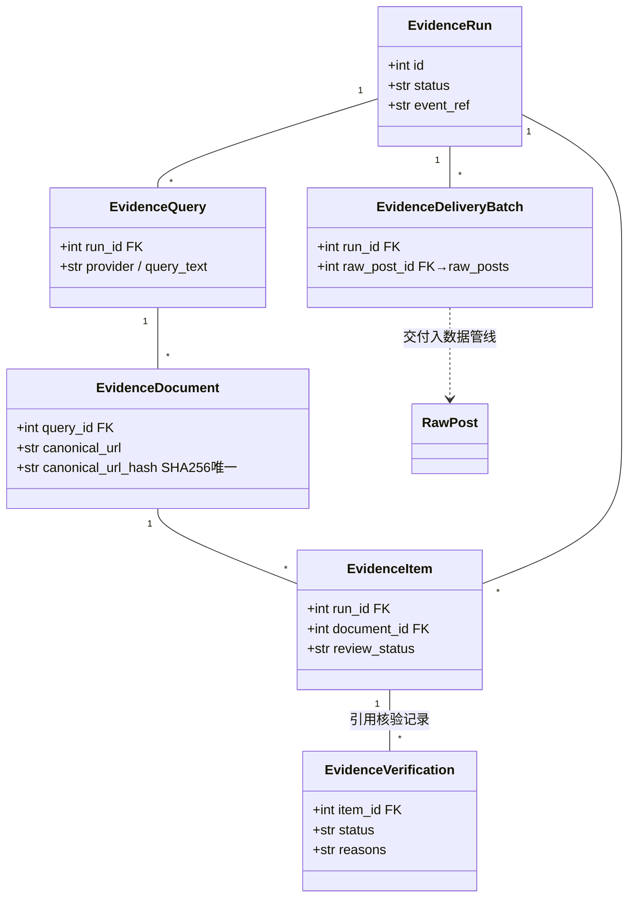

### 3.2 分层与核心域类图

**图 3-4 后端分层结构**（接口层 → 业务层 → 核心算法层，依赖单向向下）

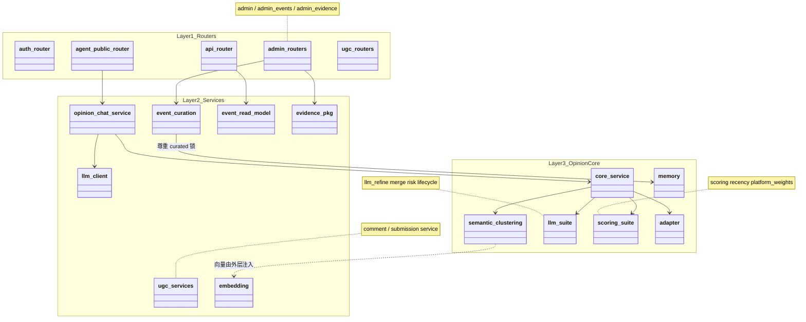

设计要点（详细论证见《架构设计文档》）：

- **核心算法层仅依赖 Python 标准库**：`public_opinion_core` 不 import FastAPI/SQLAlchemy/torch，embedding 向量由外层注入（依赖倒置），因此该层可独立测试、可整包移植（本项目双仓同步正是利用了这一点）。
- **OpinionNote 便携数据类**是层间数据契约：数据库行经 `adapter` 转为 `OpinionNote` dataclass 后进入算法层，算法层对存储形态零感知。

---

## 4. 动态行为模型（序列图）

### 4.1 对话式舆情问答（UC-01 主流程）

**图 4-1** `POST /api/agent/public/chat/stream`

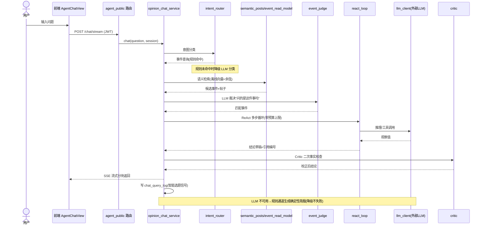

### 4.2 舆情事件生成管线（UC 数据管线核心）

**图 4-2** `scripts/generate_public_events.py`

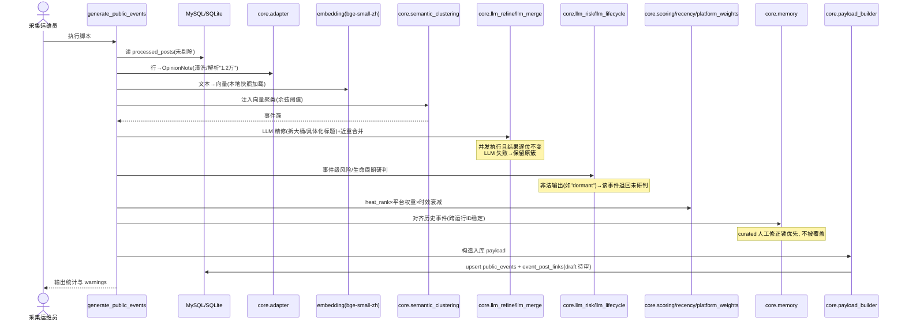

### 4.3 证据核验全链路（UC-03）

**图 4-3** 证据采集 → 核验 → 人审 → 交付

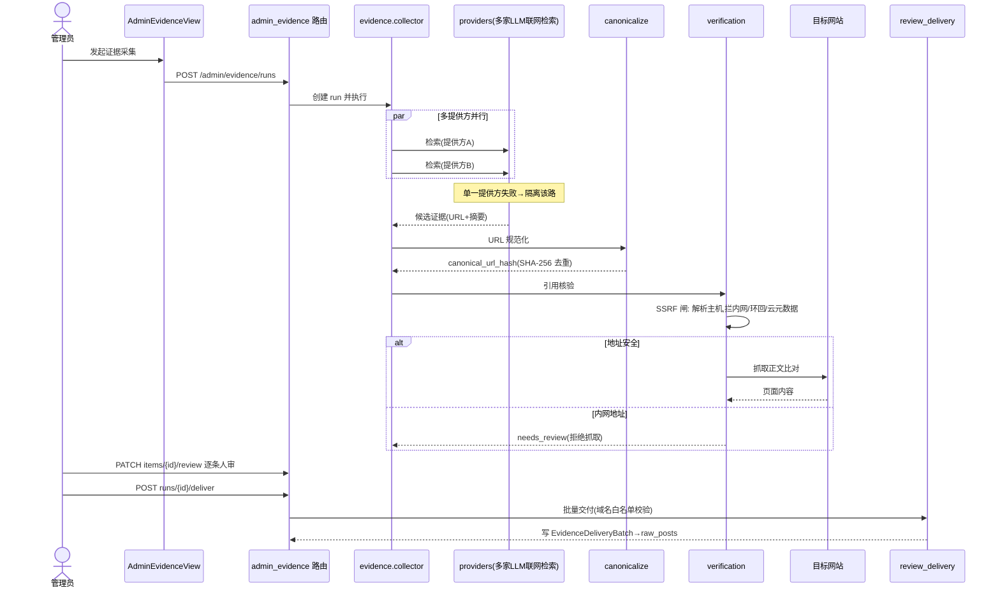

---

## 5. 状态模型（状态机图）

### 5.1 舆情事件审核状态机

**图 5-1** `PublicEvent.status`（取值与 `admin_events.VALID_EVENT_STATUSES` 一致）

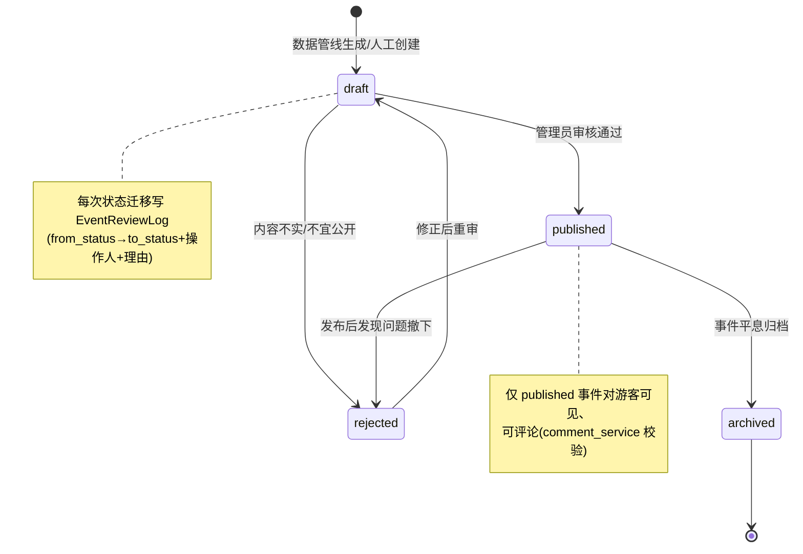

### 5.2 用户投稿状态机

**图 5-2** `UserSubmission.status`

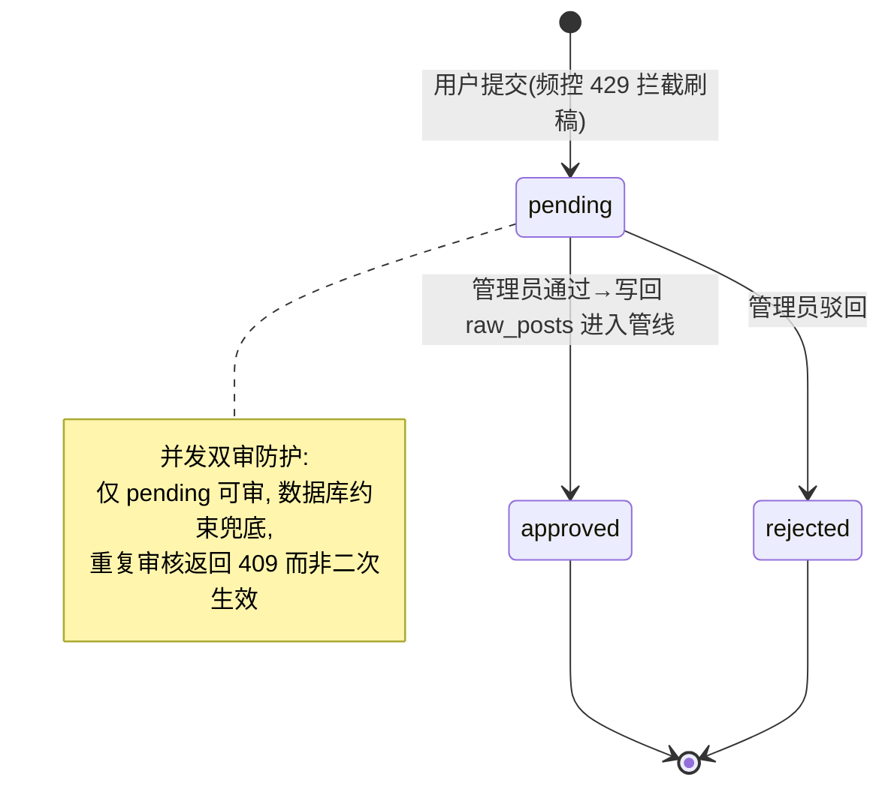

### 5.3 评论状态机

**图 5-3** `EventComment.status`

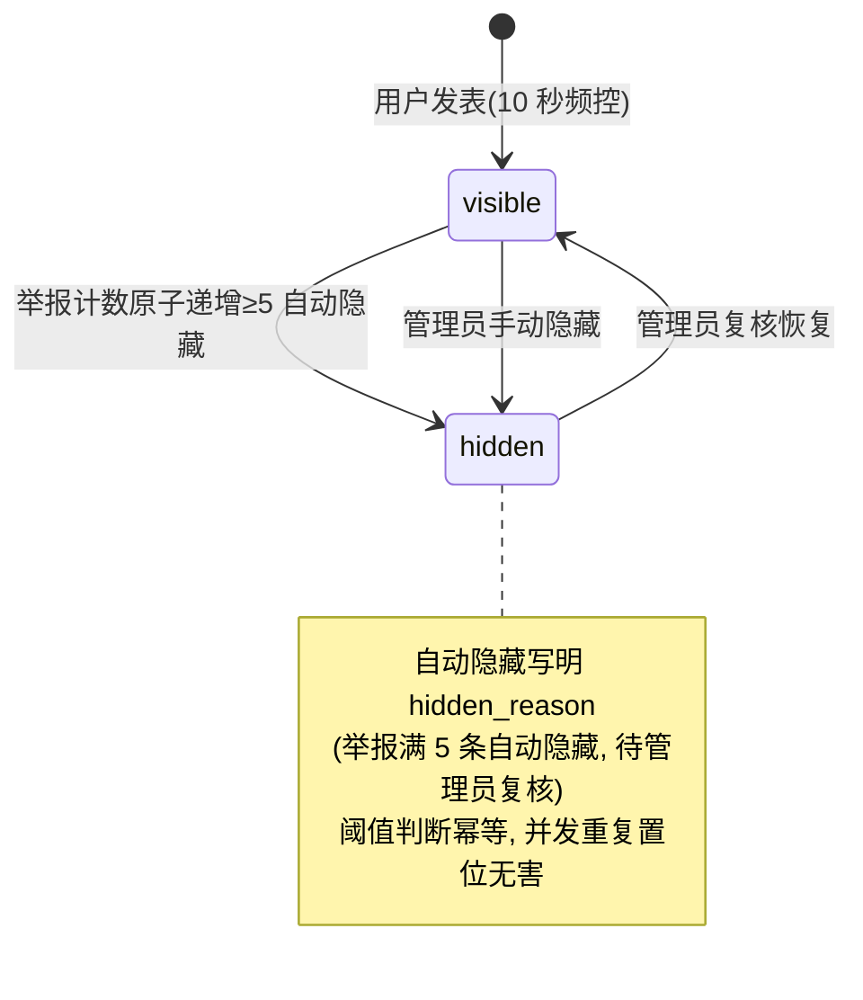

### 5.4 分布式爬取队列任务状态机

**图 5-4** `crawl_task_queue.status`（多机协同核心）

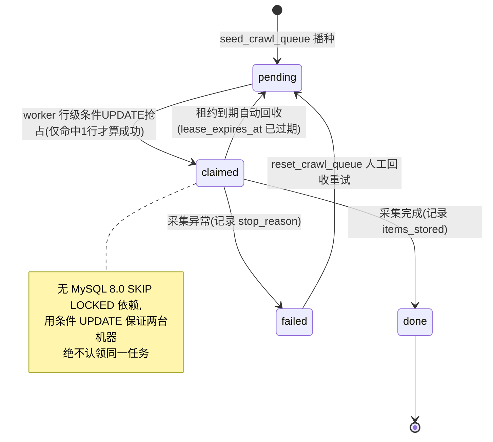

### 5.5 事件生命周期研判标签

**图 5-5** LLM 生命周期研判（`LLM_LIFECYCLES` 枚举），注意这是**研判标签**而非人工流转状态，随每轮管线重新评估：

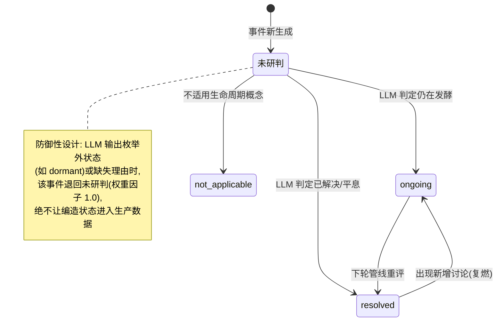

---

## 6. 模型—代码一致性映射

每张图均可在源码中逐一核对（这也是本报告"模型准确反映系统结构"的证据）：

| 图 | 源码锚点 |
|----|----------|
| 图 2-1~2-3 用例图 | `frontend/src/router/index.js`（角色守卫）、`backend/routers/*`（端点）、`scripts/*`（管线用例） |
| 图 3-1 业务域类图 | `backend/models.py`（RawPost/ProcessedPost/PublicEvent/EventPostLink/EventComment/UserSubmission） |
| 图 3-2 审计域类图 | `backend/admin_models.py`（User/CrawlTask/EventReviewLog/AdminOperationLog/SystemLog 等） |
| 图 3-3 证据子域类图 | `backend/models_evidence.py`（六表） |
| 图 3-4 分层类图 | `backend/routers/` → `backend/services/` → `backend/agent/public_opinion_core/` 目录结构与 import 方向 |
| 图 4-1 问答序列图 | `backend/services/opinion_chat_service.py`、`intent_router.py`、`event_judge.py`、`react_loop.py`、`critic.py`、`citations.py` |
| 图 4-2 管线序列图 | `scripts/generate_public_events.py`、`public_opinion_core/{adapter,semantic_clustering,llm_refine,llm_merge,llm_risk,llm_lifecycle,scoring,recency,platform_weights,memory,payload_builder}.py` |
| 图 4-3 证据序列图 | `backend/services/evidence/{collector,providers,canonicalize,verification,review_delivery,scope_policy}.py` |
| 图 5-1 事件状态机 | `backend/routers/admin_events.py`（`VALID_EVENT_STATUSES = {"draft","published","rejected","archived"}`） |
| 图 5-2 投稿状态机 | `backend/services/submission_service.py`（pending/approved/rejected、409 并发守卫） |
| 图 5-3 评论状态机 | `backend/services/comment_service.py`（visible/hidden、`AUTO_HIDE_REPORTS = 5`） |
| 图 5-4 队列状态机 | `MediaCrawler/store/crawl_queue.py`（pending/claimed、租约回收 SQL） |
| 图 5-5 生命周期标签 | `public_opinion_core/llm_lifecycle.py`（`LLM_LIFECYCLES = ("resolved","ongoing","not_applicable")`） |

---

## 7. 建模工具与维护约定

- **工具链**：Mermaid（文本化 UML），VS Code / Typora 实时预览，GitHub/GitLab 原生渲染；
- **维护约定**：修改涉及库表结构、状态枚举、层间依赖的代码时，同一 PR 内同步更新对应模型图（列入代码评审检查项）；
- **一致性保障**：状态枚举类模型（图 5-1~5-5）的取值直接引用代码常量，评审时以代码为准核对，防止模型腐化。

---

*本报告全部 13 张模型图基于终版代码绘制；第 6 章映射表可用于逐图核对。*
