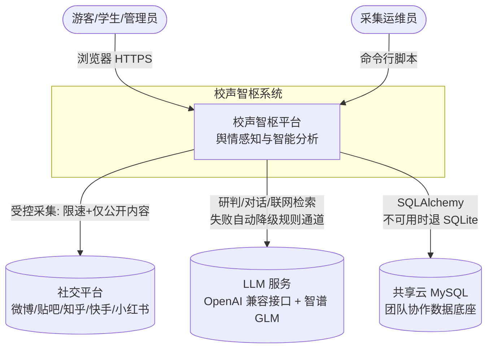
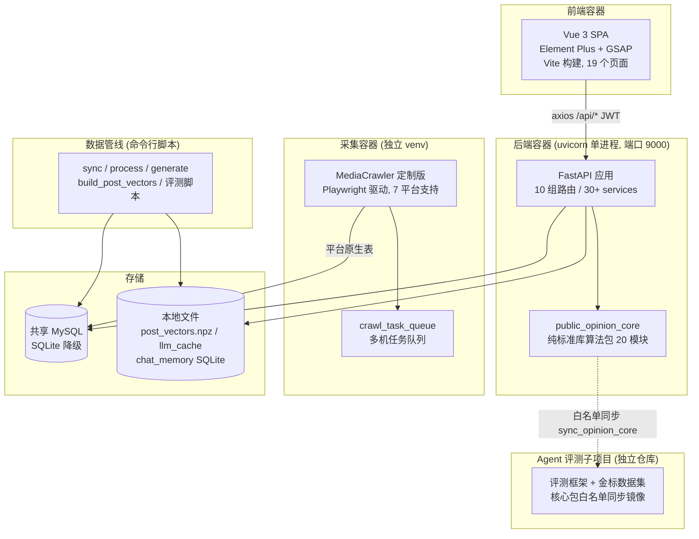
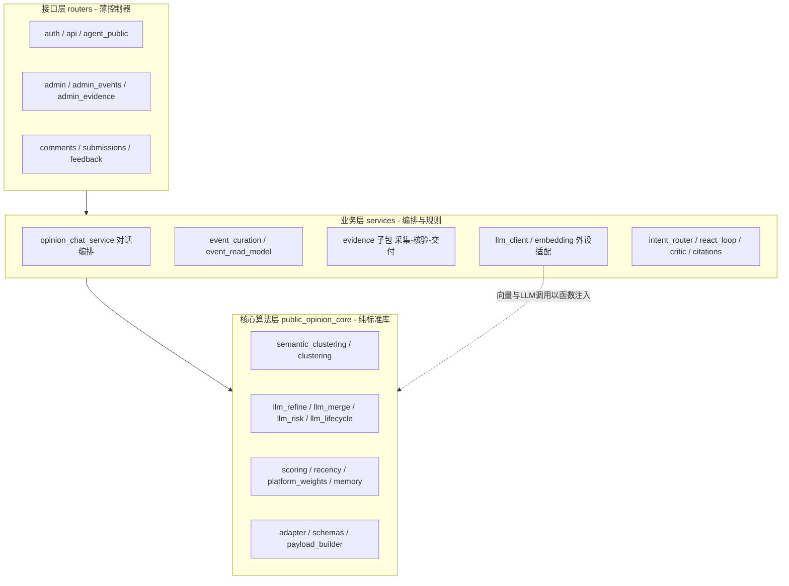
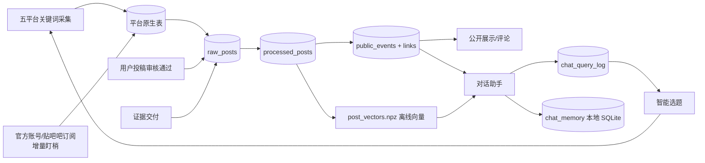
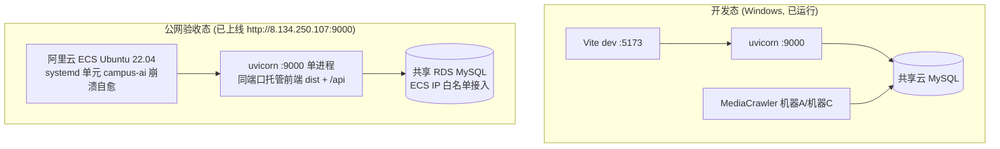

# 校声智枢（Campus AI Agent）架构设计文档

> 《软件工程》期末大作业 · 交付物 3 / 9
>
> 项目名称：校声智枢 · Campus AI Agent —— 校园舆情感知与智能分析平台
> 团队成员：李泽勋（组长）、刘思雨、陈继橦、胡津
> 文档版本：v2.0（终版）

## 修订历史

| 版本 | 阶段 | 变更说明 |
|------|------|----------|
| v1.0 | 第 1~2 周 | 总体分层、三级数据模型、技术选型 |
| v1.5 | 第 3~5 周 | Agent 架构（意图路由/ReAct/Critic）、双通道降级、双仓同步机制 |
| v2.0 | 第 7 周 | 证据核验子域、多机采集队列、安全纵深复盘、公网部署视图；ADR 全量整理 |

---

## 1. 引言

### 1.1 文档目的与读者

本文档描述校声智枢的总体架构、分层设计、关键架构决策（以 ADR——Architecture Decision Record 形式记录）及横切关注点设计，回答三个问题：**系统由什么组成、为什么这样设计、代价是什么**。

与其他交付物的关系：《需求分析报告》定义"做什么"（本档引用其 FR/NFR 编号）；《系统建模报告》给出 UML 细节模型；本档聚焦架构级视图与决策论证；部署操作细节见《软件配置与运维文档》。

### 1.2 架构设计原则

全项目共同遵守四条原则（在代码评审中作为架构守门标准）：

1. **可测量的用算术，需要判断的用 AI**——确定性计算（热度、衰减、排序）绝不交给 LLM；语义判断（"像不像""是不是一件事"）绝不硬编码规则。每处 AI 都必须有不可替代性。
2. **失败方向永远朝安全侧**——LLM 输出非法就退回未研判、检索无结果就明说没有、静默的错误答案是最坏的缺陷类别。
3. **增强不绑架可用性**——一切外部依赖（LLM、联网检索、共享 MySQL、torch）都有降级路径，断网/无 Key/轻依赖环境下系统功能完整。
4. **单一事实源**——核心算法只有一份代码（白名单同步）、需求只有一份基线、状态枚举只在一处定义。

---

## 2. 架构目标与约束

从需求报告 NFR 导出的架构驱动力（Architecture Drivers）：

| 驱动力 | 来源 | 对架构的要求 |
|--------|------|--------------|
| 问答 P50 ≤ 20s、事件列表 ≤ 1s | NFR-P1/P3 | 检索离线向量化、消 N+1、LLM 并发调用 |
| 断网/无 Key 可运行 | NFR-R1、NFR-C2 | 全 AI 环节双通道、embedding 本地快照、测试零网络 |
| 多人多机协作、低成本 | 约束 2/4 | 共享 MySQL + SQLite 降级、数据库队列（不引入 MQ/Redis） |
| 内容安全与可审计 | NFR-S2~S6 | SSRF 出站闸、注入防御、三类审计日志、人审终审 |
| 7 周内交付、四人协作 | 约束 1 | 分层解耦、模块可独立开发测试、接口契约先行 |
| 公网远程验收 | NFR-C3/C4 | 前端静态构建 + 后端单进程可低成本部署 |

---

## 3. 总体架构

### 3.1 系统上下文（C4 第 1 层）

**图 3-1 系统上下文图**

### 3.2 容器视图（C4 第 2 层）

**图 3-2 容器图**：系统由 6 个可独立运行/部署的容器组成

各容器职责与技术栈：

| 容器 | 技术栈 | 职责 | 运行形态 |
|------|--------|------|----------|
| 前端 SPA | Vue 3 + Vue Router + Element Plus + GSAP + Vite | 19 个页面、角色路由守卫、可视化 | 静态产物（dist），开发期 5173 |
| 后端服务 | FastAPI + SQLAlchemy + Pydantic | 全部业务 API、鉴权、Agent 对话 | uvicorn 单进程 :9000 |
| 核心算法包 | **纯 Python 标准库** | 聚类/研判/排序/记忆等 20 个模块 | 随后端加载，可独立测试 |
| 采集端 | MediaCrawler（Playwright）定制版 | 5 平台采集、多机队列协同、官方账号/贴吧吧订阅式增量盯梢 | 独立 venv，命令行 |
| 数据管线 | Python 脚本（30+） | 同步/清洗/事件生成/向量构建/评测 | 命令行，幂等可复跑 |
| 评测子项目 | FastAPI + 自研评测框架 | 金标数据集、消融实验、算法验证 | 独立仓库/venv，:8000 |

### 3.3 后端组件视图（C4 第 3 层）

**图 3-3 后端三层组件图**（依赖单向向下，禁止反向 import）

分层契约：

- **接口层**只做参数校验、鉴权、调用业务层、包装统一响应（`{code, message, data}`，见 dev-guide §4）；
- **业务层**持有数据库会话与外部客户端，编排核心层能力；
- **核心层零框架依赖**：不 import FastAPI/SQLAlchemy/torch/openai。LLM 调用与 embedding 向量以**函数注入**（依赖倒置）方式进入，层间数据契约为 `OpinionNote` dataclass。

---

## 4. 关键架构决策（ADR）

> 每条 ADR 记录：背景 → 备选方案 → 决策 → 理由 → 代价与缓解。状态均为"已采纳并交付"。

### ADR-01 核心算法包纯标准库化 + 双仓白名单同步

- **背景**：Agent 算法先在独立子项目中孵化验证，再集成进主系统；两仓并存期间算法代码面临"两处维护、必然漂移"的风险。
- **备选**：a) 打成 pip 包发布安装；b) git submodule；c) 复制粘贴人工维护；d) 白名单文件同步脚本。
- **决策**：核心包只依赖标准库（凡外部能力一律注入），配 `scripts/sync_opinion_core.py` 白名单单向同步（21 个核心文件 + 8 个 service 文件），dry-run 预览后 `--apply`，同步后跑子仓全量回归。
- **理由**：pip 包/submodule 对 7 周课程项目运维成本过高；纯标准库让核心包在两仓的任何环境都能加载，白名单让同步范围显式受控，dry-run 的 OVERWRITE 清单就是变更评审单。
- **代价与缓解**：同步是手动触发——缓解：同步纪律写入流程（改核心包必须当日同步+回归），并有 23 次子仓 sync 提交记录佐证执行。

### ADR-02 LLM 优先、规则兜底的双通道降级

- **背景**：聚类精修、风险研判、情绪分类、意图路由、对话生成都依赖外部 LLM；但课程演示环境可能断网，免费 API 额度可能耗尽。
- **备选**：a) 强依赖 LLM，失败即报错；b) 纯规则不用 LLM；c) 双通道——LLM 优先、确定性规则兜底。
- **决策**：全部 9 处 AI 环节均实现 c。降级路径逐处明确：精修失败保留原簇、研判非法退回未研判、对话降级为确定性简报、路由降级规则词表。
- **理由**：a 违背"增强不绑架可用性"原则，在验收现场是致命风险；b 质量不达标（聚类 23.7% vs 65.7%）。双通道以约 15% 的额外代码换来了"任何环境都能演示 + 测试零网络依赖"两个决定性收益。
- **代价与缓解**：两条通道都要测试——缓解：测试矩阵对每个 AI 模块分别覆盖"LLM 正常/LLM 异常/无 LLM"三态，这也是测试规模达 1600+ 的原因之一。

### ADR-03 AI 职责划分：embedding 判"像不像"，LLM 判"是不是"

- **背景**：事件聚类如果全交 LLM，成本与延迟不可控；全用向量相似度，则"两个都提到饭堂的不同事件"会被错并。
- **备选**：a) 纯 LLM 聚类；b) 纯向量阈值聚类；c) 向量粗聚 + LLM 精裁。
- **决策**：c。bge-small-zh-v1.5 余弦相似度（阈值 0.65）完成粗聚类，LLM 只在边界场景介入：拆大桶、裁决近重簇合并、判定"用户问的是否是这件事"。
- **理由**：向量相似度便宜、可离线、可复现，负责召回；LLM 贵而准，只花在"判断题"上。消融实验证明两者缺一质量都显著下降。
- **代价与缓解**：阈值 0.65 是超参——缓解：以 66 条人工标注黄金集校准，阈值与检索对齐复用同一数值，避免双阈值漂移。

### ADR-04 三级数据模型 + 软删除 + 人工修正锁

- **背景**：舆情数据要同时满足"可清洗重跑"“可人工修正"“可审计追责"三个矛盾诉求。
- **备选**：a) 单表存帖子直接打事件标签；b) raw → processed → events 三级模型。
- **决策**：b，且加两道保护：`excluded` 软删除（帖子剔除不物理删，保留证据链）；`curated` 人工修正锁（管理员改过的事件，自动管线不得覆盖）。
- **理由**：raw 层保证"永远可以从头重算"；processed 层隔离清洗逻辑变更；events 层承载人工审核状态。软删除与修正锁解决"机器批量重跑 vs 人工精修"的写冲突——机器永远让位于人。
- **代价与缓解**：三级模型多两次落库——缓解：全部管线脚本幂等，重复执行零副作用；事件-帖多对多用 link 表承载，删除事件级联清理（外键一致性有专项测试）。

### ADR-05 多机采集协同用数据库任务队列，不引入消息中间件

- **背景**：语料采集需要 2~3 台机器并行，且各机网络环境不同、随时可能掉线。
- **备选**：a) Redis/RabbitMQ 任务队列；b) 人工分表格认领关键词；c) 复用共享 MySQL 做任务队列。
- **决策**：c。`crawl_task_queue` 表 + 行级条件 UPDATE 抢占（`WHERE id=? AND status='pending'`，受影响行数==1 才算认领）+ 租约超时自动回收。
- **理由**：团队已有共享 MySQL，引入 MQ 是纯增量运维成本；条件 UPDATE 在 MySQL 5.7 上就能保证互斥（不依赖 8.0 的 SKIP LOCKED），掉线机器的任务由租约机制自动回收，无需人工干预。
- **代价与缓解**：轮询有秒级延迟——对采集场景（单任务分钟级）完全可接受。

### ADR-06 统一 LLM 接入：OpenAI 兼容客户端 + 缓存 + 重试 + 用量追踪

- **背景**：项目用到多家模型（主通道智谱 glm-4-plus 直连、容灾备胎 gpt-5.4 中转站、证据检索多提供方），接口风格与稳定性不一。主备顺序经实测调优——中转站 gpt-5.4 会**卡住不报错**导致备胎无法触发，故改为更稳的智谱直连打主力、中转站降为兜底。
- **决策**：自研轻量 `llm_client`：OpenAI 兼容协议统一接入，内置指数退避重试、本地磁盘响应缓存、逐调用用量追踪；模型/端点全部 `.env` 可配。
- **理由**：兼容协议让"换模型"变成改两行配置；本地缓存让评测复跑不重复扣费、开发迭代提速；用量追踪支撑 `/agent/public/usage` 的成本可见性。
- **代价与缓解**：缓存可能返回陈旧结果——缓解：缓存 key 含完整 prompt，语义变更自然失效；缓存文件不入库（.gitignore）。

### ADR-07 MySQL / SQLite 双后端 + 演示快照

- **背景**：共享云 MySQL 是免费实例，可能限流或不可达；课程验收不能赌网络。
- **决策**：SQLAlchemy 统一 ORM，`DATABASE_URL` 一键切换；`make_demo_snapshot` 导出本地 SQLite 演示快照；冒烟脚本设 `--allow-mysql` 闸门防误写共享库。
- **理由**：ORM 抽象成本已付，双后端几乎免费；快照让演示环境自包含。
- **代价与缓解**：SQLite 不校验外键导致一类 bug 测不出（真实发生过：删除事件在 MySQL 上 500）——缓解：审计后补齐级联删除并增加外键一致性专项测试，此教训写入测试报告。

### ADR-08 证据核验独立子域 + 出站安全闸

- **背景**：联网证据引入了新攻击面（抓取任意 URL）与新数据形态（外部文档），不能污染主管线。
- **决策**：证据域独立成 6 张表 + `services/evidence` 独立子包；出站抓取前强制 SSRF 检查（解析主机名，拦截私网/环回/链路本地/云元数据地址）；域名白名单（scope）约束交付范围；人工审核是入库前的最后一道闸。
- **理由**：子域隔离让主管线零感知证据实现细节；"机器采集、人工终审"符合"失败朝安全侧"原则。
- **代价与缓解**：跟随重定向后的逐跳复检未做（residual risk 已文档化）——缓解：provider 返回的 URL 先过 scope 白名单，直连内网这一现实主向量已被拦截。

### ADR-09 语义检索用"离线向量文件 + 在线余弦"，不引入向量数据库

- **背景**：帖子级语义检索需要向量能力；候选方案含 Milvus/Qdrant/pgvector。
- **决策**：`build_post_vectors` 离线构建 `post_vectors.npz`，在线加载后纯 numpy 余弦计算。
- **理由**：语料量级（10³）下向量数据库是杀鸡用牛刀；npz 文件随快照分发，演示环境零额外服务。10⁵ 级以上再演进到 pgvector（演进路径已在技术债清单）。
- **代价与缓解**：新帖入库到可检索有一次离线构建的延迟——缓解：构建脚本纳入管线固定步骤，分钟级完成。

### ADR-10 前端 SPA + 双重权限校验 + 静态构建部署

- **背景**：三类角色页面差异大；最终需公网部署供远程验收。
- **决策**：Vue 3 单页应用，路由守卫按 `meta.roles` 前端拦截 + 后端 JWT 逐接口校验（**前端守卫只是体验优化，安全边界在后端**）；生产以 Vite 静态构建产物部署，与后端同源反代避免跨域。
- **理由**：SPA 契合仪表盘型交互；静态产物 + 单进程后端是最低成本的公网部署形态（详见运维文档）。
- **代价与缓解**：SPA 首屏体积——缓解：Vite 分包 + 生产构建；本项目页面规模下非瓶颈。

### ADR-11 Agent 对话链路：规则路由前置，ReAct 有预算上限

- **背景**：对话延迟主要耗在 LLM 轮次；多步推理有失控风险（无限工具循环）。
- **决策**：意图路由**规则优先**（动态词表，毫秒级返回），LLM 只兜底分类；ReAct 循环带硬性步数/预算上限；引用编号在生成时注入并由 Critic 复核。
- **理由**：约 70% 问题被规则路由直接分流，是 P50 14.1s 的关键；预算上限保证最坏情况有界；"引用+复核"把可信度做成架构属性而非提示词技巧。
- **代价与缓解**：规则词表需维护——缓解：`router_keywords` 支持从数据中动态刷新词表。

---

## 5. 横切关注点设计

### 5.1 安全纵深

五层防线 + 审计兜底；凭据管理单列：`.env` 不入库、仓库仅 `.env.example` 键名模板、爬虫登录态仅存本地浏览器目录。

### 5.2 可观测性

| 手段 | 载体 | 用途 |
|------|------|------|
| 任务记录 | crawl_tasks / evidence_runs / agent_run_logs | 每次采集、证据、Agent 运行留档，后台概览展示管线健康 |
| 审计日志 | event_review_logs / admin_operation_logs | 谁在何时改了什么，可追责 |
| 系统日志 | system_logs + 应用日志 | 异常定位 |
| 用量追踪 | llm_client 计量 + /agent/public/usage | LLM 成本可见 |
| 评测留档 | docs/data/eval_benchmark_*.json | 每轮基准结果版本化，性能可比对 |

### 5.3 错误处理与幂等约定

- 竞态一律**数据库约束兜底**：唯一约束冲突映射为 409（注册/投稿双审/重复采集），绝不返回 500 或产生脏数据；
- 计数器**原子更新**（举报数 `UPDATE ... SET n = n + 1`），阈值判断幂等；
- 管线脚本**可复跑**：建表 IF NOT EXISTS、导入 upsert、生成对齐历史事件记忆；
- 异步任务取消（CancelledError）**单独捕获后重抛**，不得被通用异常吞掉产生虚假成功遥测（五平台一致性修复的教训）。

### 5.4 配置管理

三层配置：`.env`（环境与凭据，不入库）→ `llm_config/config.py`（运行时读取与默认值）→ 功能开关（`EVENT_REFINE_ENABLED` 等按环节独立开关，支持消融实验与故障隔离）。

---

## 6. 数据架构

**图 6-1 数据流与存储拓扑**

存储职责划分：**共享 MySQL** 承载全部协作数据；**本地文件**承载三类不宜共享的数据——离线向量（体积大、可重建）、LLM 缓存（含 prompt、可重建）、会话记忆（用户隐私、写穿备份）。所有本地文件均可由管线脚本重建，不构成单点。

---

## 7. 部署视图

**图 7-1 部署拓扑（开发态 → 公网验收态）**

公网形态要点：单云主机承载，uvicorn 同端口托管前端静态产物与 `/api`，systemd 常驻自愈；数据直连共享 RDS；内置演示账号（普通用户/管理员各一）供评审登录。原方案的 Nginx 反代（:80 静态直出 + 后端仅监听 127.0.0.1）资产保留在 `deploy/` 作为安全加固升级路径，方案与实际上线形态的逐项差异对照见《软件配置与运维文档》§5.4。

---

## 8. 质量属性达成矩阵

| 质量属性 | 架构机制（本文档出处） | 量化证据 |
|----------|------------------------|----------|
| 性能 | 规则路由前置、离线向量、消 N+1、LLM 并发（ADR-09/11） | P50 14.1s；事件接口 4.2s→0.7s；基准 63/63 |
| 可靠性 | 双通道降级、幂等管线、租约回收（ADR-02/05/07） | 1600+ 测试零网络依赖全绿 |
| 安全性 | 五层纵深 + 审计（§5.1、ADR-08） | SSRF 8 专项用例；注入对抗用例；三类审计日志 |
| 可维护性 | 三层分层、纯标准库核心、白名单同步（ADR-01、§3.3） | 核心包独立测试；两仓 221+23 次提交无漂移事故 |
| 可移植性 | 双后端、本地快照、可选重依赖（ADR-07） | 断网环境全功能演示验证 |
| 可演进性 | 功能开关、ADR 留档、演进路径明确（§5.4） | 消融实验体系即"开关架构"的直接产物 |

---

## 9. 已知风险与技术债

诚实记录当前架构的边界（均已评估影响并有处置计划）：

| 项 | 现状 | 影响评估 | 计划 |
|----|------|----------|------|
| 问答 P95 较高（基线 32.3s） | 长尾问题多步推理轮次多 | 交互有流式输出缓解体感 | 后续：工具结果缓存、并行工具调用 |
| SSRF 重定向逐跳复检未做 | 已拦直连内网 + scope 白名单前置 | 残余风险低且已文档化 | 后续：自定义传输层逐跳校验 |
| ~~CI 未在远端托管执行~~（已解决） | 仓库已推送 GitHub（begger2025/campus-ai-agent），Actions 三任务随 push/PR 自动执行（PR #2 实证首跑） | 本地 `check.ps1` 与远端 CI 同口径双保险 | 后续：main 分支保护强制 CI 通过 |
| 向量检索线性扫描 | 10³ 量级性能充裕 | 10⁵ 级后退化 | 演进路径：pgvector |
| 部分路由存在内联业务逻辑 | comments/submissions 路由较厚 | 不影响正确性，略增维护成本 | 重构清单已建，逐步下沉 services |

---

*本文档 11 条 ADR 均对应已交付的真实实现，可与代码及《系统建模报告》第 6 章映射表交叉核验。*
