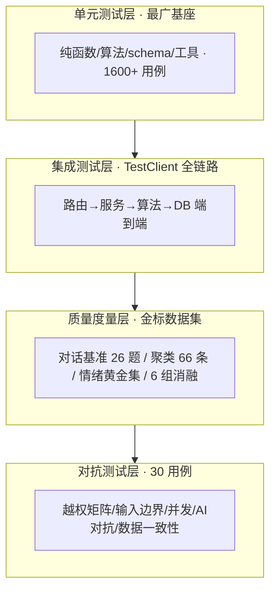

# 校声智枢（Campus AI Agent）软件测试与质量保证报告

> 《软件工程》期末大作业 · 交付物 5 / 9
>
> 项目名称：校声智枢 · Campus AI Agent —— 校园舆情感知与智能分析平台
> 团队成员：李泽勋（组长）、刘思雨、陈继橦、胡津
> 文档版本：v2.0（终版）
>
> 配套附件：《缺陷跟踪台账》（05a-缺陷跟踪台账.md），本报告第 5 章引用其编号。

## 修订历史

| 版本 | 阶段 | 变更说明 |
|------|------|----------|
| v1.0 | 第 2 周 | 测试计划、单元测试基线、统一接口契约测试 |
| v1.5 | 第 4~6 周 | 评测基准框架、注入防御测试、并发竞态测试 |
| v2.0 | 第 7 周 | 对抗测试战役（5 攻击面）、缺陷台账终版、质量度量汇总 |

---

## 1. 引言

### 1.1 测试目标

本项目的测试不以"跑出一个通过率数字"为目的，而围绕一条核心质量准则展开：**杜绝"静默的错误答案"**——界面不报错但给出错误结论（假数据、检索绕过、情绪误判、编造引用）是舆情系统最危险的缺陷类别。因此测试策略同时追求两件事：

1. **验证**（功能对不对）：每个功能需求有对应的自动化测试；
2. **证伪**（能不能被搞垮）：以攻击者/刁钻用户视角主动触发隐藏缺陷。

### 1.2 测试范围

| 纳入 | 说明 |
|------|------|
| 后端 API 与业务逻辑 | 10 组路由、30+ services、鉴权、竞态 |
| 核心算法 | 聚类/研判/排序/记忆/情绪（含质量度量） |
| 采集子系统 | 队列互斥、去重、时间窗、平台一致性 |
| AI 质量 | 对话基准、引用合法性、注入防御、降级 |
| 安全 | 越权、SSRF、注入、输入边界 |
| 前端 | 构建校验（模板/脚本/样式静态检查） |

不纳入：第三方库内部逻辑、真实 LLM 服务的输出质量（用金标基准间接度量）、浏览器端 E2E（列入持续改进）。

### 1.3 质量准则（贯穿全程）

- **静默错误答案 = 最高严重级**；
- **失败方向永远朝安全侧**（LLM 非法输出退回未研判、检索无结果明说没有）；
- **测试零网络依赖**（断网可全绿，这也是 LLM 降级通道的常态化验证）；
- **缺陷必须先有失败测试复现再修**（TDD）。

---

## 2. 测试计划

### 2.1 测试层次（测试金字塔）



底层单元测试最广（保证部件正确），向上依次是集成测试（保证协作正确）、质量度量（保证 AI 效果达标）、对抗测试（保证边界安全）。四层互补，缺一层就有盲区。

### 2.2 测试类型与工具

| 类型 | 工具/框架 | 规模 | 说明 |
|------|-----------|------|------|
| 后端单元/集成 | Python unittest + FastAPI TestClient | **1184 用例** | 零网络依赖 |
| 爬虫 | pytest + pytest-asyncio | **188 用例** | 队列/去重/时间窗/一致性 |
| Agent 核心（子仓） | unittest | **305 用例** | 算法/评测/记忆/ReAct |
| AI 质量基准 | 自研评测脚本 | 26 题×4 轴 + 6 组消融 | 结果 JSON 归档可比对 |
| 前端构建校验 | Vite build | 每次回归 | 模板/脚本/样式静态检查 |
| 合计 | — | **1677 自动化用例** | 一键回归 68 秒 |

### 2.3 测试环境

- **隔离环境**：三个独立 venv（根/MediaCrawler/子仓），避免依赖串扰；
- **数据后端**：测试用内存 SQLite（StaticPool），与生产 MySQL 同 ORM，秒级建表、完全隔离；
- **零外部依赖**：LLM/网络/共享库全部 mock 或降级，任何机器断网可复现；
- **一键执行**：`check.ps1` 串起三套测试 + 前端构建，退出码=失败步数。

### 2.4 测试进度安排（与迭代同步）

| 周 | 测试重点 |
|----|----------|
| 2 | 接口契约、鉴权、公开 API 单元测试 |
| 3~4 | 意图路由、会话记忆、注入防御、评测框架 |
| 5~6 | ReAct、语义聚类、LLM 情绪、并发竞态 |
| 7 | 消融实验、引用合法性、**对抗测试战役**、缺陷台账终版 |

---

## 3. 测试用例设计

### 3.1 用例设计方法

综合运用四类经典方法，并针对 AI 系统补充对抗方法：

| 方法 | 应用示例 |
|------|----------|
| 等价类划分 | 事件状态 draft/published/rejected/archived 各取代表值 |
| 边界值分析 | 分页 page=0/1/负数、page_size=1/100/100000、举报数=阈值±1 |
| 判定表 | 情绪聚合（正/负/中/争议 × 多数派规则）、鉴权（角色 × 接口） |
| 错误推测 | 竞态、外键级联、畸形 payload、超长输入 |
| **对抗测试**（本项目特色） | 越权矩阵、注入越狱、围栏逃逸、通配符注入、静默泄漏 |

### 3.2 需求—测试覆盖矩阵（代表性）

完整矩阵见《需求分析报告》§11；下表证明每类需求都有对应测试载体：

| 需求域 | 测试载体 | 用例数 |
|--------|----------|:------:|
| 账号权限 FR-A | test_auth* + test_adversarial_authz_matrix | 越权矩阵 6 + 认证若干 |
| 事件生成 FR-C | test_event*（24 文件） | 聚类/研判/时效/风险/记忆 |
| 对话助手 FR-E | test_chat*（14 文件）+ 基准 | 路由/引用/ReAct/降级 |
| 证据核验 FR-H | test_evidence*（13 文件）+ SSRF 8 例 | 采集/核验/交付/安全 |
| 采集 FR-B | 爬虫 188 用例 | 队列/去重/时间窗 |
| 公众参与 FR-F | test_comment*/submission | 评论/举报/投稿 |

### 3.3 对抗测试用例设计（攻击者视角）

对抗测试战役按五个攻击面系统设计 30 个用例，每个攻击面对应一类刁钻行为（详见缺陷台账 §3.7）：

1. **越权矩阵**（6 例）：**动态枚举**全部 `/api/admin/*` 路由，逐个用普通用户/游客/伪造 token 打——断言绝不 2xx、绝不 5xx、绝不 422 泄露结构。动态枚举保证新增接口自动纳入，杜绝漏测。
2. **输入边界**（9 例）：LIKE 通配符、超长（5000 字）、空/纯空格、emoji、SQL 注入字符串、`<script>`、超大/负数分页——断言不崩、不越界、畸形数据不入库。
3. **并发竞态**（3 例）：重复 id 批量审核、10 秒内连发评论、举报累加到阈值——断言去重、频控、原子性。
4. **AI 对抗**（9 例）：注入话术中和、伪造 `</data>` 围栏逃逸转义、诱导编造、超长淹没、LLM 报错降级不编造——基于 prompt_guard 真实行为校准断言。
5. **数据一致性**（3 例）：删事件级联清理（无孤儿 link/comment/review_log）、剔除帖后检索不泄漏、移出最后成员被拒（不留空壳）。

**设计亮点**：动态枚举（越权面自动全覆盖）、真实行为校准（AI 面断言对齐 prompt_guard 实际实现，不凭想象）、失败朝安全侧（断言的都是"绝不发生坏事"而非"恰好发生某事"）。

---

## 4. 测试执行与结果

### 4.1 自动化回归结果

| 套件 | 用例数 | 结果 | 耗时 |
|------|:------:|------|------|
| 后端 unittest | 1184 | ✅ 全绿 | 53s |
| 爬虫 pytest | 188 | ✅ 全绿 | 4s |
| 子仓 unittest | 305 | ✅ 全绿 | 2s |
| 前端构建 | — | ✅ 通过 | 8s |
| **一键回归 check.ps1** | **1677** | **✅ 全绿** | **68s** |

### 4.2 AI 质量基准结果

| 指标 | 结果 | 载体 |
|------|------|------|
| 对话基准总分 | 63/63（100%） | eval_chat_benchmark.py（26 题×4 轴） |
| 引用合法率 | 100% | 同上引用判分项 |
| 问答延迟 P50 / P95 | 14.1s / 32.3s | 基准 JSON 归档 docs/data/ |
| 聚类质量（黄金集） | 语义 65.7% vs 规则 23.7% | 子仓 clustering_eval + 66 条标注 |
| 情绪分类准确率 | 75% → 100% | 消融前后对比 |
| 消融实验 | 6 组开/关对照 | scripts/ablation_*（快照哈希锁定可复现） |

### 4.3 对抗测试战役结果

30 个对抗用例全部执行：**发现 1 个中低危真缺陷（DEF-D14 LIKE 通配符注入，已 TDD 修复），其余四个攻击面全部守住**。这一结果本身是质量保证有效性的核心证据——不是"没测所以放心"，而是穷尽刁钻行为后系统依然安全。战役中另纠正一处过程误判（详见缺陷台账 §3.7）。

---

## 5. 缺陷跟踪

### 5.1 缺陷生命周期

```
发现（用户实测/审计/基准/对抗） → 定级（阻断>严重>一般>轻微）
  → TDD 红（失败测试复现） → 修复（绿） → 全量回归 → Conventional Commit 留档
  → 涉同步白名单则回移子仓回归 → 登台账
```

**铁律**：没有失败测试复现的缺陷不允许直接改代码；每个缺陷的修复提交可 `git show <hash>` 复核。

### 5.2 缺陷统计（详见《缺陷跟踪台账》）

- **收录 38 项**：阻断 1 / 严重 17 / 一般 16 / 轻微 4；另有已知限制 5、暂缓 1。
- **发现渠道**：用户实测 11、代码审计 14、真机/真库排障 6、评测基准与数据对账 5、对抗测试战役 1。
- **全部闭环**：每项均带失败测试复现 + 修复提交 + 回归验证。

### 5.3 代表性缺陷（体现"静默错误答案"治理）

| 编号 | 缺陷 | 为何危险 | 修复验证 |
|------|------|----------|----------|
| DEF-P01 | MySQL 删事件 500（SQLite 测不出） | 生产崩溃，测试环境盲区 | 级联删除 + 生产语义专项用例 |
| DEF-D04 | 火灾事件情绪判 positive | 静默错误结论 | 多数派+确定性平票用例 |
| DEF-S01 | 证据核验 SSRF | 可访问内网/云元数据 | 8 例专项用例 |
| DEF-D14 | LIKE 通配符注入 | 搜 % 返回全部（静默错误） | 对抗测试发现 + 转义修复 |

### 5.4 复盘教训（转化为流程约束）

1. **SQLite 测不出 MySQL 外键**（DEF-P01）→ 约束类变更必附"生产语义"专项用例；
2. **过滤器只管新数据，存量要回溯清** → 数据规则变更后跑存量对账；
3. **测试自身也会腐化**（DEF-P06/C06）→ 测试红了先判"缺陷还是测试错了"，两种结论都留档。

---

## 6. 质量保证方法

测试只是质量保证的一环，本项目的质量保证是一套**立体体系**：

| 手段 | 作用 | 有效性证据 |
|------|------|-----------|
| **TDD**（红-绿-重构） | 缺陷先复现再修，杜绝"改了但没验证" | 38 项缺陷全部按此闭环 |
| **一键全量回归** | 提交前分钟级发现回归 | check.ps1 68 秒 1669 用例 |
| **持续集成** | 推送/PR 自动回归 | GitHub Actions 三任务，零密钥 |
| **金标基准 + 消融** | AI 效果量化、可复现、防"为做而做" | 快照哈希 + temperature=0 |
| **代码评审** | PR review 清单（dev-guide §6） | PR #2 走完整流程 |
| **对抗测试** | 攻击者视角主动证伪 | 30 用例 5 攻击面 |
| **零网络测试纪律** | 降级通道常态化验证 | 断网全绿 |
| **双仓同步回归** | 核心算法跨仓一致 | dry-run 评审 + 305 用例回归 |

### 6.1 质量度量看板

| 度量项 | 数值 |
|--------|------|
| 自动化用例总数 | 1677 |
| 全量回归耗时 | 68s |
| 测试网络依赖 | 0 |
| 缺陷闭环率 | 38/38（100%） |
| 对抗测试攻击面覆盖 | 5/5 |
| AI 基准通过率 | 63/63 |
| 引用合法率 | 100% |

---

## 7. 结论与持续改进

### 7.1 结论

项目建立了覆盖单元、集成、质量度量、对抗四层的测试体系（1677 自动化用例 + 30 对抗用例），配合 TDD、一键回归、CI、金标基准、消融实验、缺陷台账等质量保证手段。对抗测试战役穷尽五类刁钻行为，仅发现 1 个中低危缺陷并当场修复，印证系统质量与质量保证方法的有效性。**测试计划分层合理、用例覆盖全面、缺陷跟踪与质保方法闭环有效。**

### 7.2 持续改进

如实列出下一步（部分依赖课程周期外时间）：

1. **前端 E2E**：引入 Playwright 模拟真实用户点击流；
2. **覆盖率门禁**：CI 中加 coverage 阈值检查；
3. **对抗测试常态化**：把 30 个对抗用例纳入 CI 每次执行；
4. **Issues 看板**：缺陷台账迁移 GitHub Issues，与 PR 自动关联；
5. **变异测试**：用 mutation testing 反向检验测试套件的有效性。

---

*本报告所有用例数、缺陷编号、基准数字均可在仓库、docs/data/ 留档与《缺陷跟踪台账》中复核。*
