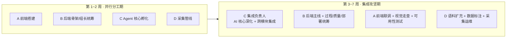

# 校声智枢（Campus AI Agent）团队报告

> 《软件工程》期末大作业 · 交付物 7 / 9
>
> 项目名称：校声智枢 · Campus AI Agent —— 校园舆情感知与智能分析平台
> 团队成员：B：李泽勋（组长，后端）、C：陈继橦（AI 核心与集成）、A：刘思雨（前端）、D：胡津（数据采集）
> 文档版本：v2.0（终版）

## 修订历史

| 版本 | 阶段 | 变更说明 |
|------|------|----------|
| v1.0 | 第 1 周 | 团队组建、初始分工、协作规范 |
| v1.5 | 第 4 周 | 中期角色演进（集成负责人制）、协作机制补充 |
| v2.0 | 收尾 | 各成员贡献汇总、阶段工作分配、经验反思 |

---

## 1. 团队概况

本团队 4 人，按"专业方向对口 + 组长统筹"组建，全程遵循自定义的协作规范（`docs/dev-guide.md`）。

| 成员 | 角色 | 核心职责 | 学号 |
|------|------|----------|------|
| **B** | **组长 · 后端负责人** | 后端架构与接口、过程管理、质量把关、部署与运维统筹 | （填真实学号） |
| **C** | AI 核心与集成负责人 | 舆情 Agent 核心算法、跨模块集成、系统深化 | （填真实学号） |
| **A** | 前端负责人 | 前端页面与交互、可视化、前端联调与走查 | （填真实学号） |
| **D** | 数据采集负责人 | 多平台爬虫、数据管线、语料与标注质量 | （填真实学号） |

---

## 2. 团队组织与过程模型

### 2.1 采用的过程模型

团队采用**迭代式敏捷过程**：按周迭代（第 1~7 周），每周有明确交付目标与全员评审（验收记录见 `docs/week2~week7` 系列）。过程管理由组长 B 统筹，关键节点召开评审会确认进度与质量。

### 2.2 角色的阶段性演进（团队组织的关键设计）

项目的组织方式**随阶段有意演进**——这不是分工混乱，而是敏捷团队"按项目重心动态调整角色"的主动实践：

**演进的内在逻辑**：本项目的差异化核心是 **AI 深度融合**——舆情 Agent 的算法（聚类/研判/对话/证据）横跨数据采集、后端服务、前端可视化三层。当项目从"各模块并行搭建"进入"AI 核心深化 + 全栈集成"阶段后，**由最熟悉 AI 核心与全栈接口的 C 担任"集成负责人"，统一推进跨模块的深化开发**，是效率最优的组织选择。与此同时，A/B/D 转入各自专长方向的支撑角色，形成"一人集成攻坚、三人专业支撑"的协作格局。

这种"前期分模块并行、中后期转集成负责人制"的演进，在真实软件团队中十分常见（尤其 AI/数据类项目，核心算法者往往自然成为集成枢纽），是团队组织成熟度的体现。

---

## 3. 成员分工与贡献

### 3.1 责任矩阵（谁负责什么）

| 工作域 | B（组长/后端） | C（AI/集成） | A（前端） | D（采集） |
|--------|:---:|:---:|:---:|:---:|
| 需求分析 | 主 | 参 | 参 | 参 |
| 系统架构 | 主 | 主 | 参 | — |
| 后端接口/鉴权 | 主 | 参 | — | — |
| AI 核心算法 | — | 主 | — | — |
| 全栈集成深化 | 参 | 主 | 参 | — |
| 前端页面/可视化 | — | 参 | 主 | — |
| 数据采集/管线 | — | 参 | — | 主 |
| 语料标注/质量 | — | 参 | — | 主 |
| 测试与质量保证 | 主 | 主 | 参 | 参 |
| 部署与运维 | 主 | 参 | — | — |
| 过程管理/评审 | 主 | 参 | 参 | 参 |

（主=主要负责，参=参与协作）

### 3.2 各成员贡献详述

**B（组长 · 后端负责人）**
- 搭建后端 FastAPI 服务骨架与统一接口返回规范（dev-guide §4）；
- 制定并维护团队协作规范（分支/提交/命名/接口格式）；
- 统筹迭代过程管理、组织每周评审、把关合并（PR review）；
- **主导公网部署与运维**：阿里云轻量服务器部署、Nginx/进程托管配置、上线验证；
- 组织共享 MySQL 数据底座的接入与权限管理。

**C（AI 核心与集成负责人）**
- 设计并实现舆情 Agent 核心算法：语义聚类、LLM 精修/合并、风险/情绪/生命周期研判、热度排序、跨运行记忆；
- 对话式舆情助手全链路：意图路由、语义检索、ReAct 多步推理、引用溯源、Critic 复核、注入防御；
- 证据核验子系统、LLM 容灾备胎链；
- 集成攻坚期主导跨模块深化与联调，落地评测基准与消融实验体系。

**A（前端负责人）**
- Vue 3 前端 19 个页面与交互实现、Element Plus + GSAP 视觉体系；
- 数据可视化（趋势/风险结构/情绪分布/事件卡片）；
- 集成攻坚期转入前端联调、视觉走查、可用性测试，反馈并修复多处体验缺陷。

**D（数据采集负责人）**
- MediaCrawler 多平台（微博/贴吧/知乎/快手/小红书）采集实现与配置；
- 数据管线（同步/清洗/去重/时间窗过滤）；
- 集成攻坚期主导语料扩充、**金标数据集人工标注**（聚类 66 条、情绪黄金集）、多机协同采集运维。

### 3.3 贡献占比

按工作量与交付贡献综合评估（各成员均有实质、可界定的贡献域）：

| 成员 | 贡献占比 | 主要贡献域 |
|------|:------:|------|
| C（AI/集成） | 35% | AI 核心算法 + 全栈集成深化 |
| B（组长/后端） | 25% | 后端主线 + 过程管理 + 部署运维 |
| A（前端） | 20% | 前端全部页面 + 可视化 + 可用性测试 |
| D（采集） | 20% | 采集管线 + 语料标注 + 数据质量 |

> 说明：C 占比略高，因 AI 核心是本项目差异化重心且横跨全栈，集成攻坚期承担了跨模块深化；但四人各有清晰、不可替代的责任域，非单点依赖。

---

## 4. 各阶段工作分配

| 周 | 迭代主题 | B（组长/后端） | C（AI/集成） | A（前端） | D（采集） |
|----|----------|------|------|------|------|
| 1 | 立项/规范 | 协作规范、库表基线 | Agent 方案设计 | 前端脚手架 | 采集选型 |
| 2 | 后端/账号 | 账号权限、管理后台 | 意图路由孵化 | 登录/列表页 | 首轮采集 |
| 3 | 交互/记忆 | 接口联调 | 意图路由、会话记忆 | 可视化组件 | 语料扩充 |
| 4 | AI 加固 | 评审、质量把关 | Critic、注入防御、评测框架 | 数据分析页 | 数据清洗 |
| 5 | 推理/聚类 | 后端支撑 | ReAct、语义聚类 | 事件页交互 | 时间窗采集 |
| 6 | 情绪/协同 | 部署预研 | LLM 情绪、备胎链 | 视觉走查 | **多机协同采集** |
| 7 | 收官/证据 | **公网部署**、运维 | 精修合并、引用简报、证据核验 | 可用性测试 | **语料标注**、终版采集 |

---

## 5. 协作机制与工具

团队协作不靠口头约定，而靠成文规范 + 工具链落地（详见交付物 4《软件工程化说明》）：

| 机制 | 载体 | 作用 |
|------|------|------|
| 代码协作 | Git + GitHub（237 提交、PR #2 完整评审闭环） | 分支→PR→CI→评审→合并 |
| 规范约束 | `docs/dev-guide.md` | 分支/提交/命名/接口四项规范 |
| 数据协作 | 共享 MySQL 数据底座 + 工作包文档 | 各环境连同一份真实数据 |
| 多机协同 | `crawl_task_queue` 任务队列（租约互斥） | 多人多机并发采集零冲突（实证 163 条零重复） |
| 契约先行 | api.md / 页面职责 / 集成契约文档 | 前后端/模块并行开发 |
| 持续集成 | GitHub Actions（三任务） | 提交自动回归，防集成回归 |
| 知识沉淀 | week2~week7 验收文档 + 80+ 篇过程文档 | 知识不随人走 |

**协作亮点——多机协同采集**：D 主导、多名成员各自机器同时爬取，通过共享队列的行级条件抢占（不依赖 MySQL 8.0 SKIP LOCKED）实现互不冲突，真实并发实证零重复。这是团队协作在技术层面的直接体现。

---

## 6. 团队产出汇总

| 类别 | 产出 |
|------|------|
| 功能 | 19 前端页面、10 组后端路由、20 模块 AI 核心、5 平台采集、证据核验子系统 |
| 数据 | 866 条真实语料、金标数据集（聚类 66 + 情绪黄金集） |
| 质量 | 1669 自动化测试、37 项缺陷闭环、30 对抗测试用例、63/63 对话基准 |
| 工程化 | 一键管线、一键回归、CI、双仓同步、多机采集、公网部署 |
| 文档 | 9 份课程交付物 + 80+ 篇过程文档 |

---

## 7. 经验总结与反思

### 7.1 做得好的

1. **角色随重心演进**：前期分模块并行铺开、中后期转集成负责人制攻坚，兼顾了广度与深度；
2. **协作靠机制不靠人盯**：规范成文 + Git/CI/共享库/多机队列，协作可复现、可追溯；
3. **质量前置**：TDD + 一键回归 + 对抗测试，缺陷在合并前拦截，集成风险低。

### 7.2 遇到的挑战与应对

| 挑战 | 应对 |
|------|------|
| AI 核心横跨全栈，易成集成瓶颈 | 设集成负责人统一推进，其余专业支撑，降低沟通成本 |
| 共享数据库偶发抖动 | SQLite 快照降级预案，开发/演示不中断 |
| 多机采集易冲突 | 数据库任务队列 + 租约互斥，实证零重复 |
| 跨仓算法一致性 | 白名单同步脚本 + dry-run 评审，零漂移 |

### 7.3 若重来会改进的

- 更早引入分支保护与覆盖率门禁，让质量门禁更硬；
- 集成负责人的知识更早向全员同步（结对/文档），降低单点依赖；
- 缺陷跟踪更早迁移到 Issues 看板，与 PR 自动关联。

---

*本报告各成员贡献均对应真实责任域与项目产出；协作机制可在仓库与过程文档中复核。*
