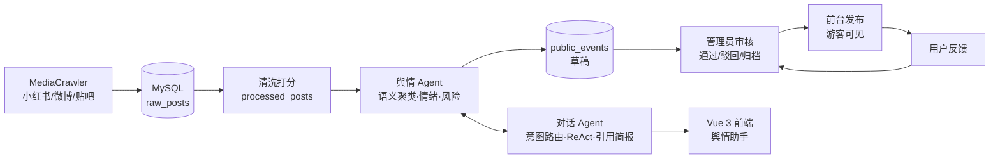

# 答辩演示指南（一页纸）

> 给第一次接触本项目的人：跟着下面的动线走一遍，10 分钟看完全部核心能力。

## 演示前准备（前一天做完）

- [ ] `run.bat` 起服，`admin/admin123456` 和 `user/user123456` 各登录一次确认正常
- [ ] 重新生成离线快照：`.venv\Scripts\python.exe scripts\make_demo_snapshot.py`
- [ ] 试跑一次 `demo.bat`，确认断网降级可用（这是 MySQL/网络出事的保险）
- [ ] 对话页问一次"给我一份校园舆情简报"，确认 LLM Key 有额度、引用角标正常
- [ ] 浏览器清掉旧 localStorage（或用无痕窗口），演示"游客→注册→使用"完整动线

## 10 分钟演示动线

| # | 操作 | 预期看到 / 讲解点 |
|---|------|------------------|
| 1 | 打开 http://127.0.0.1:9000 ，**不登录**直接看首页、事件列表、点开一个事件 | 游客可浏览已发布事件；详情有代表帖溯源。讲：数据是真实爬取的校园讨论（小红书 182 条），事件由 AI 聚类生成、管理员审核后发布 |
| 2 | 登录页 → **注册一个新账号** → 自动登录 | 真实 JWT 认证，注册即登录，角色权限隔离 |
| 3 | 进**舆情助手**，问"最近有什么热点？" | 20~30s 出答案，带意图/路由徽标。讲：LLM 意图路由，规则兜底 |
| 4 | 追问"**那有什么风险吗？**"（不带主语） | 话题自动继承——多轮对话记忆 |
| 5 | 问"**对比一下食堂和宿舍哪个风险更高？**" | 1~2 分钟（有进度条和阶段文案），出对比结论 + "查看推理过程（N 步）"折叠面板。讲：ReAct 多步推理，Agent 自主决定调哪些工具 |
| 6 | 问"**给我一份校园舆情简报**" | 简报每个论断句末带 `[来源:pN]` 角标。讲：引用强制 + 幻觉引用确定性校验 + Critic 二次审校——AI 输出可审计 |
| 7 | 看**个人事项**页：新建一条待办；点一个中高风险事件的"影响评估" | 本地待办真实可用；影响评估展示事件真实关注点/风险依据 |
| 8 | 在事件列表提交一条**反馈** | 讲：闭环马上在后台看到 |
| 9 | 退出 → **admin 登录** → 后台概览 | KPI 全真实。讲：帖子→清洗→事件→审核的数据链路 |
| 10 | **事件审核**：把一条草稿"通过"（或驳回，驳回必填原因）→ 点"历史" | 审核留痕时间线；前台事件列表立即可见 |
| 11 | **运维中心**：处理刚才那条反馈；扫一眼系统日志/操作审计/用户管理 | 讲：全局异常自动落 system_logs；管理动作全部审计 |

## 评委常见问题速答

- **数据哪来的？** MediaCrawler 爬小红书（微博/贴吧已接入，账号受限），
  `crawl.bat → import_latest.bat` 全链路可复现，共享 MySQL 里 182 条真实帖。
- **事件怎么聚出来的？** bge-small-zh 语义嵌入 + 贪心余弦聚类；配套 66 条人工
  标注黄金集评测（成对 F1 65.7%，比规则聚类 +42pp），做过消融实验量化每个
  模块贡献（子项目 docs/week7-agent-ablation-study.md）。
- **AI 胡说怎么办？** 三层防御：简报论断强制标注来源编号 → 确定性校验抓
  "引用了不存在的编号" → Critic LLM 对照数据二次核查，问题以警示条展示。
- **LLM 挂了怎么办？** 全链路规则兜底：断网/无 Key 时路由、情绪、聚类、简报
  自动降级，页面显示降级提示——可以现场拔网线演示。
- **MySQL 挂了怎么办？** `demo.bat` 切本地 SQLite 快照，全功能照常。
- **安全做了什么？** PBKDF2 口令哈希、JWT、角色权限、提示注入防御（数据围栏 +
  注入模式清洗）、Markdown 渲染先转义后排版（无 XSS）、密钥全部走 .env 不入库。
- **测试怎么做的？** 后端 54 个测试零网络依赖秒级跑完；Agent 核心在独立子项目
  用 TDD 开发（249 测试），白名单脚本单向同步进主项目。

## 架构一图

## 应急预案

| 状况 | 动作 |
|------|------|
| 共享 MySQL 连不上 | 关服 → `demo.bat`（提前跑过快照） |
| LLM 超额/超时 | 不用救——降级本身是卖点，指着"规则摘要+降级提示"讲鲁棒性 |
| 复杂问题太慢 | 演示动线第 5 步放最后问，等待期间讲第 6~8 步 |
| 端口占用 | `stop.bat` 释放 9000 |
