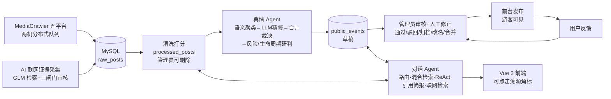

# 答辩演示指南（一页纸）

> 给第一次接触本项目的人：跟着下面的动线走一遍，12 分钟看完全部核心能力。
> （2026-07-16 更新：覆盖引用溯源、语义检索、联网检索、人工修正、合并裁决等新能力）

## 演示前准备（前一天做完）

- [ ] `run.bat` 起服，`admin/admin123456` 和 `user/user123456` 各登录一次确认正常
- [ ] 重新生成离线快照：`.venv\Scripts\python.exe scripts\make_demo_snapshot.py`
- [ ] 试跑一次 `demo.bat`，确认断网降级可用（这是 MySQL/网络出事的保险）
- [ ] 刷新语义向量：`.venv\Scripts\python.exe scripts\build_post_vectors.py`
- [ ] 对话页问一次"给我一份宿舍搬迁舆情简报"，确认 LLM Key 有额度、**角标可点**
- [ ] 浏览器清掉旧 localStorage（或用无痕窗口），演示"游客→注册→使用"完整动线

## 12 分钟演示动线

| # | 操作 | 预期看到 / 讲解点 |
|---|------|------------------|
| 1 | 打开 http://127.0.0.1:9000 ，**不登录**看首页、事件列表、点开一个事件 | 游客可浏览已发布事件（人工审核过的对外结论）。讲：数据来自五平台真实爬取（800+ 条、两机分布式并行采集），事件由 AI 聚类研判、管理员审核后发布 |
| 2 | 登录页 → **注册一个新账号** → 自动登录 | 真实 JWT 认证，角色权限隔离 |
| 3 | 进**舆情助手**，问"最近有什么热点？" | 秒回路由（规则抢答，零 LLM 分类开销）+ 流式正文。讲：LLM 意图路由 + 语料话题词自动抢答 |
| 4 | 问"**饭堂涨价有什么讨论？**"（库里字面只有"食堂"） | 语义检索命中食堂价格帖。讲：**LIKE 搜不到改写说法**，离线向量 + 在线余弦补集，孤证从严双阈值防假阳性 |
| 5 | 追问"**那有什么风险吗？**"（不带主语） | 话题自动继承（LLM 判断 continue/switch）；**重启服务也不失忆**（本地持久记忆） |
| 6 | 问"**给我一份宿舍搬迁舆情简报**" | 简报角标 **[1][2] 可点击**：帖子角标跳原帖、事件角标跳工作台；底部「参考来源」清单；关联事件卡只弹**回答实际引用**的事件。讲：引用强制 + 幻觉引用确定性校验 + Critic 审校（人话化警示条） |
| 7 | 问"**对比一下食堂和宿舍哪个风险更高？**" | ReAct 多步推理（实时步骤：检索→研判下钻→对比），可折叠推理过程。讲：6 个工具含事件证据链下钻、趋势、情绪分布 |
| 8 | 问"**联网查操场翻新**" | 联网检索真实站外来源（sysu.edu.cn 官网），回答标注「站外信息，未经入库审核」+ 可点链接。讲：GLM 检索接口，引用来自搜索引擎索引——伪造 URL 结构上不可能；每对话限一次 |
| 9 | 进**舆情工作台**选一个事件 | 四轴优先级分解（严重性×时效×状态=排序分）、LLM 风险依据、生命周期"判断 vs 测量"分开标注、代表帖可回原帖。讲：**AI 的每个结论都能被追问"凭什么"** |
| 10 | 退出 → **admin 登录** → **事件审核**：点开一条事件 | 详情抽屉：完整研判证据链 + 代表帖原文。演示**人工修正**：改名 / 把一条近重事件**合并**进来（source 自动归档留痕）→ 事件出现「人工修正」徽章。讲：AI 提议→人裁决→**人修正**闭环；人改过的机器永不覆盖 |
| 11 | **数据管理**：搜一条无关帖 → **剔除**（理由必填） | 讲：帖子不审核（客观事实）但可质量管控；剔除切断统计/聚类/检索全部下游，可恢复留痕 |
| 12 | **智能选题** + **运维中心**扫一眼 | 四信号推荐下一批爬取关键词（AI 参与数据工程）；反馈闭环、系统日志、操作审计 |

## 评委常见问题速答

- **数据哪来的？** MediaCrawler 五平台（小红书/快手/知乎/微博/贴吧）+ AI 联网证据采集（web）。
  两台机器从共享队列**原子认领**关键词并行爬取，主题限定 + 营销过滤 + 时间窗口，全链路可复现。
  语料 800+ 条并持续增长（播种计划 docs/keyword-seeding-plan.md）。
- **事件怎么聚出来的？** bge-small-zh 语义聚类（时间门控防跨年缝合）→ **LLM 精修**（拆桶+具体命名+
  离群剔除）→ **LLM 近重合并裁决**（灰区相似度的簇对判"是不是一件事"，宁拆不误并）→ LLM 风险/
  生命周期研判 → 人工审核。消融实验可复现（固定快照+缓存，事件 14→37、巨簇归零）。
- **AI 胡说怎么办？** 三层防御：论断强制标注来源编号 → 确定性校验抓幻觉引用 → Critic LLM 二次
  核查；前端角标可点击溯源到原帖。评测基准集 26 题把「引用合法率」做成回归门槛（当前 100%）。
- **模型出错人怎么办？** 双闸门：审核（通过/驳回/归档，留痕）+ **人工修正**（改名/合并/增删成员/
  创建/删除）——人碰过的事件上锁，机器永不覆盖、其成员帖退出聚类池。
- **LLM 挂了怎么办？** 全链路规则兜底：路由、情绪、聚类、精修、合并、研判、简报逐层自动降级，
  页面显示降级提示——可以现场拔网线演示。
- **MySQL 挂了怎么办？** `demo.bat` 切本地 SQLite 快照，全功能照常。
- **安全做了什么？** PBKDF2 口令哈希、JWT、角色权限、提示注入防御（数据围栏 + 注入清洗，
  联网内容同样过滤）、Markdown 先转义后排版（链接仅放行 http(s)）、密钥走 .env 不入库。
- **测试怎么做的？** 主项目 1100+ 个测试、Agent 核心子项目 303 个（TDD 开发，白名单单向同步），
  零网络依赖分钟级跑完；另有 26 题评测基准集跟踪「语料变多→能力变强」的过程线
  （docs/data/eval_benchmark_*.json）。

## 架构一图

## 应急预案

| 状况 | 动作 |
|------|------|
| 共享 MySQL 连不上 | 关服 → `demo.bat`（提前跑过快照） |
| LLM 超额/超时 | 不用救——降级本身是卖点，指着"规则摘要+降级提示"讲鲁棒性 |
| 复杂/联网问题太慢 | 动线第 7/8 步放最后问，等待期间讲第 9~11 步 |
| 联网检索不可用 | 跳过第 8 步即可（key 未配时入口自动隐藏，不会出丑） |
| 端口占用 | `stop.bat` 释放 9000 |
